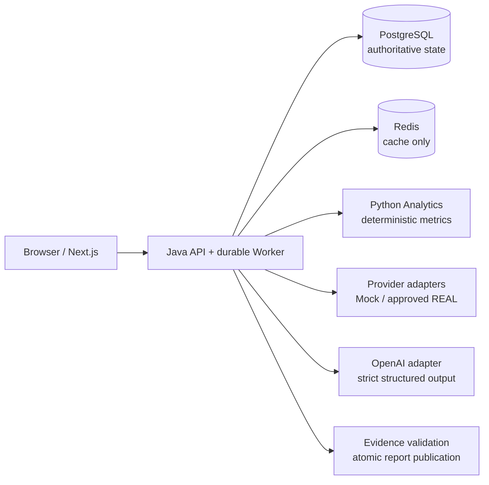

# AI Quant Research Assistant

面向美股与 ETF 的证据驱动研究平台。系统把研究问题拆解为取数、确定性计算、Evidence 注册、Claim 验证和报告发布步骤，目标是生成可复现、可追溯、会明确说明限制的研究辅助材料，而不是交易信号或收益承诺。

> 当前进度：Phase 9 工程 Gate 已完成；Phase 7 已选择并接入仅限个人内部使用的 Tiingo EOD Adapter，
> LanYi 受限 Responses endpoint、生产 Bearer、R3 保留和私有云部署资产已完成。默认本地流程仍是 Mock；
> 首次 REAL 在线验收等待旋转后的外部 Key、LanYi 准确计价和云账户。


## 已确定的产品与工程边界

- 先完成 `MOCK` 纵向闭环，固定支持 MU、NVDA、RKLB；所有页面和导出必须显示 `DEMO DATA — NOT REAL MARKET DATA`。
- 价格、指标和情景结果只能来自来源数据或版本化的确定性计算；LLM 不负责创造金融数字。
- 重要结论使用 `FACT | CALCULATION | INFERENCE | OPINION` 分类，并关联同一研究任务中的 Evidence。
- PostgreSQL 是任务、lease、状态、取消、报告版本和审计的权威来源；Redis 只做可丢失的缓存与加速。
- Java 负责 API、权限、编排和最终发布；Python 负责量化分析；Next.js 只通过 Java API 访问业务能力。
- 真实行情使用 Tiingo Individual Starter，只允许项目负责人通过 Tailscale 私网内部查看和下载；任何第二用户、公开展示或再分发都必须先升级许可。

## 技术栈

| 模块 | 技术 | 当前能力 |
| --- | --- | --- |
| `apps/web` | Next.js 16、React 19、TypeScript、Tailwind、TanStack Query、Zod、Recharts | Dashboard、完整表单、任务控制/耗时、报告图表、Evidence、Data Quality、版本/历史筛选、Provider 状态和有反馈的三格式导出 |
| `apps/api` | Java 21、Spring Boot 3.5、Spring Security Resource Server、JPA、Flyway、Redis、Resilience4j、Responses API | Research API、durable Worker、Mock/Tiingo/SEC/FRED Provider、确定性 Evidence/Claim 校验与修复、短时 Bearer、Mock/Real LLM 路由、预算与审计、报告原子发布/版本/导出 |
| `apps/analytics` | Python 3.12、FastAPI、Pydantic、Ruff、mypy、pytest | 版本化无状态分析 API：73 个收益/风险/技术/基本面/估值/情景 Metric 与可解释 Trend |
| 基础设施 | PostgreSQL 17、Redis 7.4、Prometheus、Docker Compose、GitHub Actions | JSON 日志、SLO/告警、供应链扫描、最小权限容器和五服务闭环 CI |

完整系统设计见[架构基线](docs/architecture.md)，机器可读接口见 [OpenAPI 3.1](docs/openapi.yaml)，分阶段 Gate 见[实施计划](docs/implementation-plan.md)。



## 快速启动

推荐使用 Docker Desktop 或其他兼容 Docker Compose 的运行时：

```bash
cp .env.example .env
docker compose up --build
```

启动后可访问：

- Web：<http://localhost:3000>
- Web health：<http://localhost:3000/api/health>
- Java API health：<http://localhost:8080/api/v1/health>
- Analytics health：<http://localhost:8000/analytics/v1/health>
- Prometheus metrics：<http://localhost:8080/actuator/prometheus>

也可使用：

```bash
make dev-up
make dev-down
make seed
```

`make dev-up` 会在容器启动后自动执行 smoke。首次启动前请修改 `.env` 中的 demo 密码。本地 Compose 只把应用端口绑定到 `127.0.0.1`；dev-demo 用户只允许在 `development`/`test` profile 启用，不能作为生产认证方案。

## 本地开发与验证

前置环境：Node.js 24+、pnpm 11、Python 3.12、Java 21。Maven wrapper 已包含在 API 目录。

```bash
pnpm install --frozen-lockfile
python3.12 -m venv apps/analytics/.venv
apps/analytics/.venv/bin/pip install -e 'apps/analytics[dev]'

make lint
make typecheck
make test
make build
pnpm e2e:web
```

单独启动 Web：

```bash
pnpm dev:web
```

当前验证基线：Web 的 ESLint、TypeScript、30 个 Vitest、production build 与 5 个 Playwright 用例通过；Phase 8 覆盖 Loading/Empty/Error/Partial/Completed、创建/取消/重试、Evidence、版本、历史筛选、导出成功/失败、Zod 拒绝、Provider 状态与移动视口。Web、API/Testcontainers、Analytics、secret scan 与 Compose 全仓终验见 [GitHub Actions run 29144269701](https://github.com/wubokai/AI-reserch/actions/runs/29144269701)，详细证据见 [Phase 8 测试矩阵](docs/phase8-test-matrix.md)。

Phase 9 最终需求审计：Web 全 Gate、Analytics 41 个 pytest/93.92% branch coverage、API 231 个 Surefire + 50 个 Failsafe/Testcontainers、`pnpm audit` 与 `pip-audit` 0 已知漏洞、三应用镜像 Grype 扫描、最小权限 Compose、规范化事实投影、Outbox relay 与五服务闭环均通过，见 [GitHub Actions run 29147659738](https://github.com/wubokai/AI-reserch/actions/runs/29147659738)。

FRED 检查点将 API 基线提升到 179 个 Surefire 与 46 个 Failsafe/Testcontainers；全仓终验见 [GitHub Actions run 29134411188](https://github.com/wubokai/AI-reserch/actions/runs/29134411188)。

Provider 许可检查点最初为 181 个 Surefire 测试通过。Fundamental 使用 SEC Companyfacts/XBRL；Market
现已选择 Tiingo Individual Starter，并由代码强制限制为个人私有内部用途，详见
[Provider 许可矩阵](docs/provider-license-matrix.md)。
该检查点的全仓验证见 [GitHub Actions run 29138819196](https://github.com/wubokai/AI-reserch/actions/runs/29138819196)。

SEC XBRL 检查点当前为 185 个 Surefire 与 47 个 Failsafe/Testcontainers 测试通过，新增黄金 Companyfacts fixture 覆盖修订去重、未来 filed fact、单位/年度期间、跨期拒绝及 Gross Margin、FCF、EBITDA proxy、Net Debt 手算结果。全仓终验见 [GitHub Actions run 29141192029](https://github.com/wubokai/AI-reserch/actions/runs/29141192029)。

Provider Runtime 检查点当前为 191 个 Surefire 与 48 个 Failsafe/Testcontainers 测试通过：SEC/FRED/XBRL 共用有界 Redis 缓存、只统计可重试故障的熔断器，以及 `provider.requests/cache/retries` Prometheus 指标。Redis 故障不会阻断真实取数，超大 Filing 快照会跳过缓存；TTL 被限制在大于零且不超过七天。全仓终验见 [GitHub Actions run 29142394155](https://github.com/wubokai/AI-reserch/actions/runs/29142394155)。

来源归属检查点将快照中的 Provider、官方 URL、归属声明和许可策略版本贯通到 Evidence API、报告页面及 Markdown/HTML/PDF；REAL 输出不显示 Demo 标识，Mock 输出仍强制保留。193 个 Surefire、48 个 Failsafe/Testcontainers、21 个 Vitest、Playwright 与 Compose 已通过全仓终验，见 [GitHub Actions run 29143064626](https://github.com/wubokai/AI-reserch/actions/runs/29143064626)。

Provider-neutral REAL 编排边界已移除创建、验证和发布路径中的 Mock 硬编码：REAL 可接受格式合法的目标证券，但必须在非 Demo security master 中唯一解析；缺失时明确失败，不回退 Mock。报告发布要求任务、报告、Source 与 Evidence 模式完全一致，`MIXED_TEST` 禁止发布，REAL 缺失基本面时只传递显式空输入。

当前已接入 Tiingo EOD adjusted OHLCV、SEC Filing、SEC Companyfacts/XBRL 与 FRED。Tiingo Token 只通过
Authorization header 发送，原始响应 hash、复权语义、attribution 与许可版本进入不可变 lineage；测试/CI
不发送真实外部请求。LanYi 只有同时提供旋转后的 Key、模型、HMAC 和准确计价时才会启用。

## 数据与模型配置

默认 `DATA_MODE=MOCK`。允许的规范模式只有：

- `MOCK`：固定演示数据，必须持续显示 Demo 标记；
- `REAL`：只允许使用已批准的真实 Provider，不得静默混入 Mock；
- `MIXED_TEST`：仅自动化集成测试使用，不得生成普通用户报告或导出。

缺少 `OPENAI_API_KEY` 与 `OPENAI_REPORT_MODEL`（或兼容回退 `OPENAI_MODEL`）时，报告由确定性 Mock 生成器完成；只配置 Key 或只配置模型会失败关闭。真实模式采用 Responses API、严格 JSON Schema、`store=false`、`parallel_tool_calls=false`、HMAC `safety_identifier`、输入/输出/工具轮次上限和数据库预算预留。价格未知时不允许真实调用，不会伪造成本。

单次 Research 的执行时钟从首个活动阶段开始，默认最多 15 分钟；可用
`RESEARCH_MAX_EXECUTION_MINUTES` 在 1–1440 分钟内调整。Worker 会在阶段投影、步骤执行和原子发布边界前检查该预算；到期任务以 `RESEARCH_EXECUTION_BUDGET_EXCEEDED` 失败，过期结果不会发布。

研究周期支持 `1y`、`3y`、`5y`，也可通过 API 成对提供最长五年的 `startDate/endDate`。研究深度支持 `QUICK`、`STANDARD`、`DEEP`：它们依次扩大 Filing、Evidence、确定性计算输入和 LLM 工具轮次预算，但永远不能突破部署环境的全局安全/成本上限。

SEC Adapter 默认关闭。启用时必须同时显式设置 `FILING_DATA_PROVIDER=sec`、`DATA_MODE=REAL` 和包含应用名称及受监控联系邮箱的 `SEC_USER_AGENT`。请求只允许官方 SEC 主机（测试仅允许 loopback），全局速率上限不超过 10 次/秒，并有超时、响应体大小、内容类型、重试次数和文档路径边界。Phase 7 完成前，其他 Provider 仍为 Mock，因此这不是可发布的完整 REAL 研究闭环。

FRED Adapter 同样默认关闭。启用需设置 `MACRO_DATA_PROVIDER=fred`、`DATA_MODE=REAL` 与注册的 `FRED_API_KEY`；默认读取 DFF 与 CPIAUCSL，并以任务抓取日作为 realtime vintage 边界。API key 不进入快照、来源 URL或安全异常，报告数据保留 FRED 要求的归属声明。

Tiingo Adapter 默认关闭。生产启用需设置 `MARKET_DATA_PROVIDER=tiingo`、许可确认版本和个人 Token；只
使用 `adjOpen/adjHigh/adjLow/adjClose/adjVolume`。免费 Individual 数据不得公开展示或分享导出文件。

生产参考配置是 `.env.production.example` 与 `compose.production.yml`。先运行
`scripts/init-production-secrets.sh`，只在服务器本地填入 API keys 和 LanYi 计价，再运行
`scripts/production-preflight.sh`；完整步骤见[私有云部署](docs/cloud-deployment.md)。

## 文档入口

- [可执行需求与 Must/Should/Could](docs/requirements.md)
- [架构、数据流与状态机](docs/architecture.md)
- [API 约定](docs/api.md)
- [数据模型](docs/data-model.md)
- [量化计算口径](docs/calculation-methodology.md)
- [LLM、Claim 与 Evidence 设计](docs/llm-design.md)
- [数据源与许可门禁](docs/data-sources.md)
- [Phase 7 Provider 许可矩阵](docs/provider-license-matrix.md)
- [Phase 8 前端验收矩阵](docs/phase8-test-matrix.md)
- [Phase 9 发布硬化矩阵](docs/phase9-test-matrix.md)
- [运行与发布手册](docs/operations-runbook.md)
- [24 小时私有云部署](docs/cloud-deployment.md)
- [REAL 生产验收标准](docs/production-acceptance.md)
- [可观测性与告警](docs/observability.md)
- [Provider 扩展指南](docs/provider-extension-guide.md)
- [路线图与非目标](docs/roadmap.md)
- [数据保留策略](docs/retention-policy.md)
- [SEC Companyfacts/XBRL 映射与数据质量](docs/sec-xbrl-mapping.md)
- [安全与风险登记](docs/security.md)
- [实时进度](docs/progress.md)

## 常见错误

- `INVALID_REQUEST`：确认目标为 Mock 支持的 MU/NVDA/RKLB、基准为 SPY/QQQ、周期为 1y/3y/5y，且技术分析保持启用。
- `MARKET_DATA_INCOMPLETE`：所选日期范围不足 200 个交易日，或 Provider 未覆盖完整目标/基准区间。
- `RESEARCH_EXECUTION_BUDGET_EXCEEDED`：任务已超过全局执行截止时间；先排查慢 Provider、Analytics 或 LLM，再评审是否调整上限。
- REAL 模式启动失败：这是许可、身份、模型、价格或认证配置缺失时的预期失败关闭；逐项核对[外部输入清单](docs/external-inputs.md)。
- Compose 健康检查失败或导出异常：按[运行与故障处理手册](docs/operations-runbook.md)中的分诊表处理，禁止用关闭验证或混入 Mock 的方式绕过。

## 下一步

自主管理的代码、测试、硬化、Tiingo Adapter、生产认证、R3 保留、备份和云部署资产已经完成。剩余是
一次性的外部账户操作：撤销聊天中暴露的 LanYi Key、在服务器填入新 LanYi/Tiingo/FRED Key 和准确计价、
创建云主机/Tailscale，然后执行 REAL smoke。集中清单见[项目负责人外部输入](docs/external-inputs.md)。

## 免责声明

本项目只用于研究辅助与产品开发，不构成投资建议，不执行交易，也不承诺任何投资结果。Mock 数据不得被解释为真实或当前市场数据。
