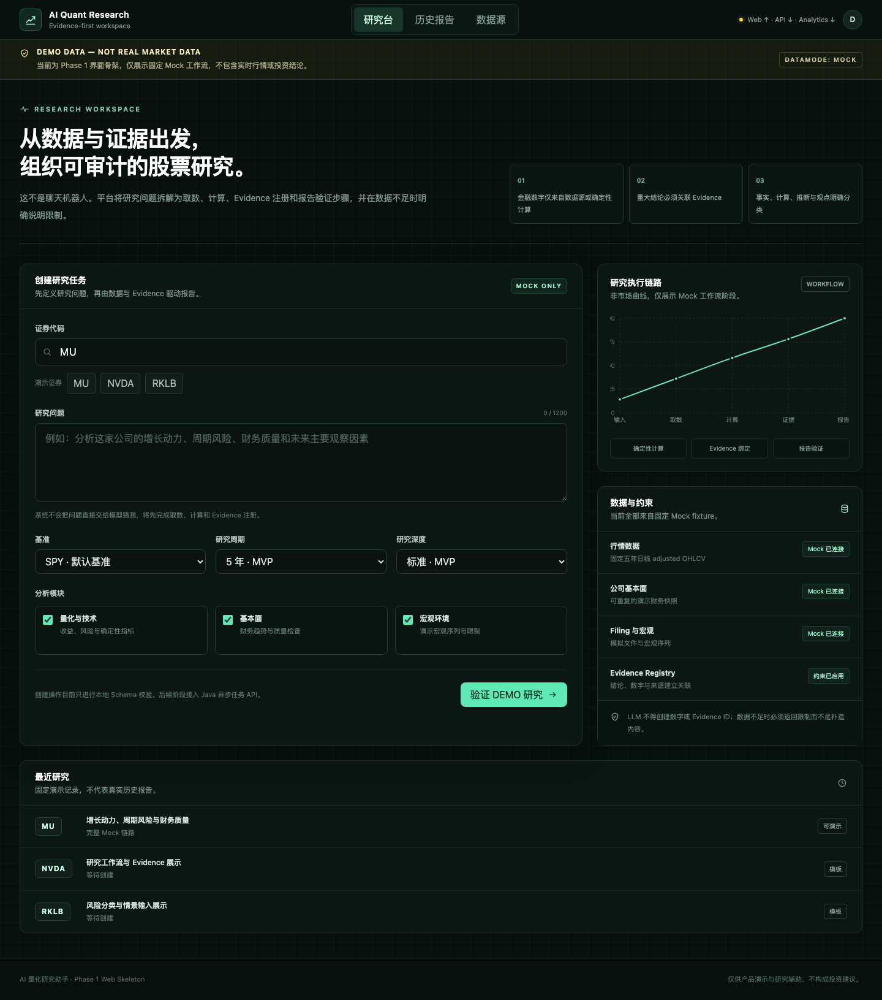

# AI Quant Research Assistant

面向美股与 ETF 的证据驱动研究平台。系统把研究问题拆解为取数、确定性计算、Evidence 注册、Claim 验证和报告发布步骤，目标是生成可复现、可追溯、会明确说明限制的研究辅助材料，而不是交易信号或收益承诺。

> 当前进度：Phase 0–6 与 Gate G6 已完成，Phase 7 正在进行。SEC Filing、FRED observation/vintage 与 SEC Companyfacts/XBRL Fundamental Adapter 已完成分段检查点；真实 Market 因许可未确认保持禁用，因此默认业务闭环仍使用固定演示数据，不产生真实或当前市场结论。



## 已确定的产品与工程边界

- 先完成 `MOCK` 纵向闭环，固定支持 MU、NVDA、RKLB；所有页面和导出必须显示 `DEMO DATA — NOT REAL MARKET DATA`。
- 价格、指标和情景结果只能来自来源数据或版本化的确定性计算；LLM 不负责创造金融数字。
- 重要结论使用 `FACT | CALCULATION | INFERENCE | OPINION` 分类，并关联同一研究任务中的 Evidence。
- PostgreSQL 是任务、lease、状态、取消、报告版本和审计的权威来源；Redis 只做可丢失的缓存与加速。
- Java 负责 API、权限、编排和最终发布；Python 负责量化分析；Next.js 只通过 Java API 访问业务能力。
- 真实行情和基本面 Provider 在 Phase 7 前完成价格、限流、存储、展示、导出和再分发许可评审后再选择。

## 技术栈

| 模块 | 技术 | 当前能力 |
| --- | --- | --- |
| `apps/web` | Next.js 16、React 19、TypeScript、Tailwind、TanStack Query、Zod | 研究创建、2 秒状态轮询、报告/Evidence/情景、Filing Chunk 检索、三种导出与历史重开的 Mock 闭环 |
| `apps/api` | Java 21、Spring Boot 3.5、Spring Security、JPA、Flyway、Redis、Resilience4j、OpenAI Responses API | Research API、durable Worker、Mock Provider、确定性 Evidence/Claim 校验与修复、Filing 检索、Mock/Real LLM 路由、调用预算与审计、报告原子发布/版本/导出 |
| `apps/analytics` | Python 3.12、FastAPI、Pydantic、Ruff、mypy、pytest | 版本化无状态分析 API：73 个收益/风险/技术/基本面/估值/情景 Metric 与可解释 Trend |
| 基础设施 | PostgreSQL 17、Redis 7.4、Docker Compose、GitHub Actions | 本地五服务编排与 CI 定义 |

完整系统设计见[架构基线](docs/architecture.md)，机器可读接口见 [OpenAPI 3.1](docs/openapi.yaml)，分阶段 Gate 见[实施计划](docs/implementation-plan.md)。

## 快速启动

推荐使用 Docker Desktop 或其他兼容 Docker Compose 的运行时：

```bash
cp .env.example .env
docker compose up --build
```

启动后可访问：

- Web：<http://localhost:3000>
- Web health：<http://localhost:3000/api/health>
- Java API health：<http://localhost:8080/api/v1/health>
- Analytics health：<http://localhost:8000/analytics/v1/health>
- Prometheus metrics：<http://localhost:8080/actuator/prometheus>

也可使用：

```bash
make dev-up
make dev-down
```

`make dev-up` 会在容器启动后自动执行 smoke。首次启动前请修改 `.env` 中的 demo 密码。本地 Compose 只把应用端口绑定到 `127.0.0.1`；dev-demo 用户只允许在 `development`/`test` profile 启用，不能作为生产认证方案。

## 本地开发与验证

前置环境：Node.js 24+、pnpm 11、Python 3.12、Java 21。Maven wrapper 已包含在 API 目录。

```bash
pnpm install --frozen-lockfile
python3.12 -m venv apps/analytics/.venv
apps/analytics/.venv/bin/pip install -e 'apps/analytics[dev]'

make lint
make typecheck
make test
make build
pnpm e2e:web
```

单独启动 Web：

```bash
pnpm dev:web
```

当前验证基线：Web 的 ESLint、TypeScript、21 个 Vitest、production build 与 4 个 Playwright 用例通过；API Phase 7 首检查点为 175 个 Surefire 与 45 个 Failsafe/Testcontainers 测试通过；Analytics 的 Ruff、strict mypy 与 41 个 pytest 继续通过。SEC 检查点的全仓终验见 [GitHub Actions run 29134112081](https://github.com/wubokai/AI-reserch/actions/runs/29134112081)，详细边界见 [Phase 7 测试矩阵](docs/phase7-test-matrix.md)。

FRED 检查点将 API 基线提升到 179 个 Surefire 与 46 个 Failsafe/Testcontainers；全仓终验见 [GitHub Actions run 29134411188](https://github.com/wubokai/AI-reserch/actions/runs/29134411188)。

Provider 许可检查点当前为 181 个 Surefire 测试通过。Fundamental 已选择 SEC Companyfacts/XBRL；Market 在取得覆盖持久化、外部展示和报告导出的书面权利前保持禁用，详见 [Provider 许可矩阵](docs/provider-license-matrix.md)。
该检查点的全仓验证见 [GitHub Actions run 29138819196](https://github.com/wubokai/AI-reserch/actions/runs/29138819196)。

SEC XBRL 检查点当前为 185 个 Surefire 与 47 个 Failsafe/Testcontainers 测试通过，新增黄金 Companyfacts fixture 覆盖修订去重、未来 filed fact、单位/年度期间、跨期拒绝及 Gross Margin、FCF、EBITDA proxy、Net Debt 手算结果。全仓终验见 [GitHub Actions run 29141192029](https://github.com/wubokai/AI-reserch/actions/runs/29141192029)。

Provider Runtime 检查点当前为 191 个 Surefire 与 48 个 Failsafe/Testcontainers 测试通过：SEC/FRED/XBRL 共用有界 Redis 缓存、只统计可重试故障的熔断器，以及 `provider.requests/cache/retries` Prometheus 指标。Redis 故障不会阻断真实取数，超大 Filing 快照会跳过缓存；TTL 被限制在大于零且不超过七天。全仓终验见 [GitHub Actions run 29142394155](https://github.com/wubokai/AI-reserch/actions/runs/29142394155)。

来源归属检查点将快照中的 Provider、官方 URL、归属声明和许可策略版本贯通到 Evidence API、报告页面及 Markdown/HTML/PDF；REAL 输出不显示 Demo 标识，Mock 输出仍强制保留。193 个 Surefire、48 个 Failsafe/Testcontainers、21 个 Vitest、Playwright 与 Compose 已通过全仓终验，见 [GitHub Actions run 29143064626](https://github.com/wubokai/AI-reserch/actions/runs/29143064626)。

当前已接入真实 SEC Filing、SEC Companyfacts/XBRL 基本面与 FRED 宏观 Provider，但尚未接入获准外部展示和报告导出的真实 Market Provider，也未在测试或 CI 中发送真实 OpenAI 请求。Phase 6 的真实 Adapter 由本地 HTTP mock 验证；部署只有同时提供 API Key、模型、HMAC secret 和带生效日期的价格版本时才会启用。成功终态仍必须与通过验证的不可变报告和运行 manifest 同事务发布。

## 数据与模型配置

默认 `DATA_MODE=MOCK`。允许的规范模式只有：

- `MOCK`：固定演示数据，必须持续显示 Demo 标记；
- `REAL`：只允许使用已批准的真实 Provider，不得静默混入 Mock；
- `MIXED_TEST`：仅自动化集成测试使用，不得生成普通用户报告或导出。

缺少 `OPENAI_API_KEY` 与 `OPENAI_REPORT_MODEL` 时，报告由确定性 Mock 生成器完成；只配置其中一个会失败关闭。真实模式采用 Responses API、严格 JSON Schema、`store=false`、`parallel_tool_calls=false`、HMAC `safety_identifier`、输入/输出/工具轮次上限和数据库预算预留。价格未知时不允许真实调用，不会伪造成本。

SEC Adapter 默认关闭。启用时必须同时显式设置 `FILING_DATA_PROVIDER=sec`、`DATA_MODE=REAL` 和包含应用名称及受监控联系邮箱的 `SEC_USER_AGENT`。请求只允许官方 SEC 主机（测试仅允许 loopback），全局速率上限不超过 10 次/秒，并有超时、响应体大小、内容类型、重试次数和文档路径边界。Phase 7 完成前，其他 Provider 仍为 Mock，因此这不是可发布的完整 REAL 研究闭环。

FRED Adapter 同样默认关闭。启用需设置 `MACRO_DATA_PROVIDER=fred`、`DATA_MODE=REAL` 与注册的 `FRED_API_KEY`；默认读取 DFF 与 CPIAUCSL，并以任务抓取日作为 realtime vintage 边界。API key 不进入快照、来源 URL或安全异常，报告数据保留 FRED 要求的归属声明。

## 文档入口

- [可执行需求与 Must/Should/Could](docs/requirements.md)
- [架构、数据流与状态机](docs/architecture.md)
- [API 约定](docs/api.md)
- [数据模型](docs/data-model.md)
- [量化计算口径](docs/calculation-methodology.md)
- [LLM、Claim 与 Evidence 设计](docs/llm-design.md)
- [数据源与许可门禁](docs/data-sources.md)
- [Phase 7 Provider 许可矩阵](docs/provider-license-matrix.md)
- [SEC Companyfacts/XBRL 映射与数据质量](docs/sec-xbrl-mapping.md)
- [安全与风险登记](docs/security.md)
- [实时进度](docs/progress.md)

## 下一步

Phase 7 的 SEC、FRED、SEC XBRL、Provider Runtime 与 SEC/FRED 多格式来源归属工程检查点已完成。下一步关闭 Gate G7 剩余项：取得真实 Market 的书面展示/导出/再分发权利后完成 Adapter、Market 归属与全 REAL 编排；在此之前 Market 保持禁用，REAL 任务不得静默混入 Mock 数据。

## 免责声明

本项目只用于研究辅助与产品开发，不构成投资建议，不执行交易，也不承诺任何投资结果。Mock 数据不得被解释为真实或当前市场数据。
