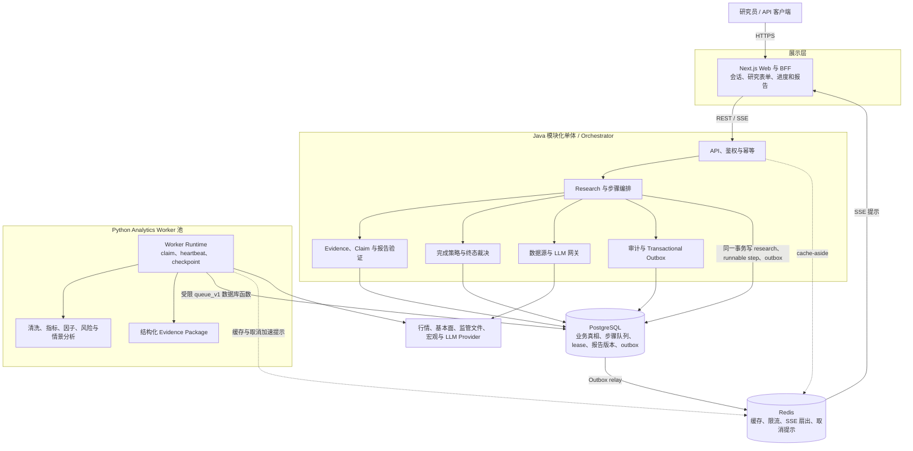

# AI Quant Research Assistant 架构基线

状态：Phase 0 基线

最后更新：2026-07-09

本文定义系统边界、组件职责和必须保持的正确性约束。执行时序见[数据流](./data-flow.md)，精确转换规则见[状态机](./state-machine.md)，队列选型见 [ADR-0001](./adr/0001-postgres-job-queue.md)。公共 Research 状态与 `docs/requirements.md`、`docs/api.md` 保持一致。

## 1. 目标与边界

系统服务于可复现、可审计的股票与 ETF 研究，不负责自动实盘交易。首期必须保证：

- 输入快照、数据来源、计算版本、Prompt、模型参数、Claim 与 Evidence 可追溯；
- 长任务可恢复、可重试、可取消，进程崩溃不丢任务；
- 执行允许至少一次，业务结果只能幂等发布一次；
- Redis、通知或单个 Worker 故障不影响权威状态；
- `PARTIALLY_COMPLETED` 有严格的安全交付门槛，不是模糊的错误兜底；
- Java 负责权限、业务编排与最终裁决，Python 负责分析计算，Next.js 不直接访问数据层。

Phase 0 非目标：交易下单、密钥托管、低延迟撮合、多区域主动写入和以 LLM 替代确定性数值计算。

## 2. 总体架构



## 3. 依赖与所有权

1. Next.js 只调用 Java API；不得直连 PostgreSQL、Redis 或 Python。
2. Java 是权限、`research_jobs`、Research 公共状态、DAG 推进、报告发布和终态的唯一业务写入者。
3. Python 只通过版本化 `queue_v1` 数据库函数改变当前 lease 授权的 `research_steps`、`step_attempts`、checkpoint 与步骤结果；不得直接更新用户、Research 终态、Claim 或报告发布状态。
4. PostgreSQL 是所有正确性判断的权威来源。
5. Redis 只优化延迟。Redis 全量丢失后，Worker 仍通过 PostgreSQL 轮询推进，UI 仍可从 Java API 补读。

建议单仓库、独立部署边界：

```text
apps/web/                         # Next.js
apps/api/                         # Java 模块化单体 / Orchestrator
apps/analytics/                   # Python Worker 与分析包
packages/shared-schemas/          # OpenAPI、JSON Schema、事件契约
packages/prompts/                 # 版本化 Prompt
docs/                             # 需求、架构、模型和 ADR
```

Java 采用模块化单体：模块之间只通过显式应用服务/事件交互，不跨模块直接访问 repository。先获得单事务一致性与快速迭代，再依据观测数据决定是否拆分。

## 4. 核心持久对象

| 对象 | 责任 | 关键约束 |
| --- | --- | --- |
| `research_jobs` | 一次 Research 的请求快照、公共阶段、进度和取消信号 | 公共状态使用既定枚举；普通工作流终态不可逆，只有显式用户重试可将 `FAILED | PARTIALLY_COMPLETED` 开启为新执行周期；`row_version` 防并发覆盖 |
| `research_steps` | Research 内的逻辑步骤，同时承载持久 runnable queue | 一任务一步骤类型唯一；`available_at` 非空才可领取 |
| `step_attempts` | 每次实际执行和 lease | 每步骤最多一个 `RUNNING` attempt；token 永不复用 |
| `source_snapshots` | 外部数据来源与不可变采集快照 | Provider、as-of、schema、内容哈希和数据模式可追溯 |
| `quant_results` | 确定性数值结果 | calculation version、input hash、单位和方法完整 |
| `evidence_items` / `claims` | 证据与可验证结论 | Claim 只能引用同 Research 的 Evidence allowlist |
| `report_versions` | 不可变安全报告 | 验证通过后发布；修复生成新版本，不覆盖旧版本 |
| `outbox_events` | 与业务事务一致的状态事件 | 至少投递一次，消费者按 event ID 去重 |

所有时间以 UTC `timestamptz` 保存；Java 金额用 `BigDecimal`；Python 按 calculation version 使用 float64 与规定舍入；跨语言载荷由版本化 JSON Schema 约束。

## 5. Research 公共状态与内部步骤

公共 Research 状态严格采用：

```text
CREATED, QUEUED, RESOLVING_SECURITY,
FETCHING_MARKET_DATA, FETCHING_FUNDAMENTALS,
FETCHING_FILINGS, FETCHING_MACRO_DATA, VALIDATING_DATA,
RUNNING_QUANT_ANALYSIS, ANALYZING_FUNDAMENTALS,
BUILDING_EVIDENCE, GENERATING_REPORT, VALIDATING_REPORT,
COMPLETED, PARTIALLY_COMPLETED, FAILED, CANCELLED
```

它在单个执行周期内是面向用户的单调阶段投影；内部步骤可按依赖并行执行。显式用户重试会开启新的执行周期。`research_steps` 只使用 `PENDING | RUNNING | SUCCEEDED | FAILED | SKIPPED | CANCELLED`。等待重试不增加新持久状态：表现为 `PENDING` 且 `available_at > now()`；UI 可派生显示 `WAITING_FOR_RETRY`。

## 6. PostgreSQL Durable Lease Queue

不建立第二套业务 Job 模型：`research_steps + step_attempts` 就是持久队列。Java 在创建 Research 或解锁后继步骤时，原子写入：

- `research_steps.status=PENDING`；
- `available_at`：`NULL` 表示依赖未满足，非空且到期表示可领取；
- 输入哈希、implementation version、优先级和重试预算；
- 同事务 outbox 事件。

Worker 使用 `FOR UPDATE SKIP LOCKED` 领取到期步骤，并在同一短事务中把步骤置为 `RUNNING`、递增 attempt 计数、创建 `step_attempts`、签发随机 `lease_token`。计算期间不持有事务或锁。

### 6.1 Lease 与 heartbeat

- 初始建议 lease 60 秒、heartbeat 20 秒，最终按 task type 与故障注入结果配置。
- heartbeat 必须匹配 `attempt_id + lease_token + status=RUNNING`，并要求旧 lease 尚未到期。
- heartbeat、完成、失败、取消和 checkpoint 均使用数据库时间；客户端时钟不参与所有权判断。
- Worker 连续两次 heartbeat 失败或收到 `STALE_LEASE` 后必须 self-fence：停止发布、停止启动新外部调用并清理自己的暂存对象。
- Reaper 将过期 attempt 标为 `LEASE_EXPIRED`；有预算时把步骤恢复为带退避的 `PENDING`，无预算时置 `FAILED`。新 attempt 必须得到新 token。
- 旧 Worker 即使恢复，也因 token 不匹配无法写入。系统保证至少一次执行，通过 fencing 和幂等发布实现 effectively-once effect。

详细 SQL、索引和权限见 [ADR-0001](./adr/0001-postgres-job-queue.md)。

## 7. 幂等边界

### 7.1 API

- 创建 Research 要求 `Idempotency-Key`；唯一范围为 `(user_id, method, path, key)`。
- 保存规范化请求哈希和首次响应。相同键、相同哈希返回原 Research；相同键、不同哈希返回 `409 IDEMPOTENCY_KEY_REUSED`。

### 7.2 步骤

步骤逻辑幂等键由 `researchId + stepType + inputHash + implementationVersion` 组成。`inputHash` 必须覆盖规范化输入、上游输出哈希、Source Snapshot、计算/Prompt 版本、Provider 模型和影响结果的参数。

已成功步骤只有在输入哈希或实现版本改变时才能重算；普通重试复用既有成功输出。

### 7.3 结果发布

Worker 先写 attempt 暂存区并计算输出哈希，再用当前 token 原子提交。相同幂等键和相同哈希返回既有结果；相同键但哈希不同进入 `IDEMPOTENCY_CONFLICT`，不得静默覆盖。报告和 Claim 仍须由 Java 验证后生成不可变 `report_versions`。

Phase 2 的 finalizer 不接受 policy boolean 作为成功发布证明：在 `report_versions` 与运行级 manifest 的同事务发布边界于 Phase 3 落地前，`COMPLETED/PARTIALLY_COMPLETED` 转换显式失败关闭。`FAILED` 与取消收敛到 `CANCELLED` 不依赖报告发布，可在 Phase 2 正常终结。

## 8. 取消语义

取消是持久、协作式信号，不新增 `CANCEL_REQUESTED` 公共状态：

1. Java 在同一事务设置 `research_jobs.cancellation_requested=true` 和时间，取消尚未运行的步骤并写 outbox。
2. Redis 可广播取消提示，但 PostgreSQL flag 才是权威。
3. 运行中 Worker 在 heartbeat、批次边界和外部调用前后检查取消；外部调用必须有超时。
4. Worker 保存安全 checkpoint，以当前 token 把 attempt/step 置 `CANCELLED`；未验证半成品不得发布。
5. 不响应的 Worker 停止续租后由 Reaper 收敛为 `CANCELLED`，不得再次入队。
6. 所有活动步骤确认终结后，Java 把 Research 置 `CANCELLED`。

若成功终态事务先于取消提交，取消幂等返回既有终态；已经 `CANCELLED` 的重复取消同样返回 `202` no-op；`FAILED` 的取消返回 `409`，应改用 retry/delete。若取消 flag 先提交，晚到的成功提交必须因条件谓词失败。已完成的内部 artifact 可保留审计，但取消后的 Research 不改判为 `PARTIALLY_COMPLETED`。

## 9. 部分完成语义

`PARTIALLY_COMPLETED` 只表示“已形成安全、可用但不完整的报告”，必须同时满足：

- 核心行情数据通过最低质量门槛；
- 核心量化结果可复现；
- 报告通过安全验证，所有保留 Claim 有合法 Evidence；
- 缺失仅来自标记为可降级的模块，或验证修复移除了不合格 Claim；
- 报告显式列出缺失模块、数据截止时间、质量问题和 limitations。

终态规则：

- `COMPLETED`：所有请求的必需步骤成功，完整策略通过，报告验证通过。
- `PARTIALLY_COMPLETED`：最小安全交付策略通过，但完整策略未通过。
- `FAILED`：未取消且无法形成安全报告，例如证券无法解析、核心行情不足或不可恢复内部错误。
- `CANCELLED`：取消已被全部活动 Worker/lease 流程确认。

终态与运行级 manifest 在同一事务发布。下游默认拒绝把 `PARTIALLY_COMPLETED` 当成完整输入，除非显式声明接受。

## 10. 缓存、事件与进度

- Redis cache-aside 键包含租户、资源 ID 和版本，并设置 TTL。
- 权限、Research/step 状态、lease、取消和报告版本不得只存在 Redis。
- Transactional outbox 与业务变化同事务落库；relay 至少投递一次。
- MVP 使用 TanStack Query 每 2 秒轮询 Java status API，终态后停止。SSE 仅为完整 v1 的可选进度优化；若启用，断线重连携带 event cursor，Next.js 从 Java API 补读 PostgreSQL 后再继续订阅。
- `progress` 为 0–100 且单次执行不倒退；内部 DAG 扩展不能使已展示进度回退。

## 11. 安全、可观测性与验收

- Worker 使用最小权限数据库角色，只能执行 `queue_v1` 函数；lease token 不进普通日志或前端。
- 日志传播 request ID、research ID、step ID、attempt ID 和 trace ID，但不记录凭据、完整 Prompt 或未脱敏 Provider 原文。
- 核心指标：可领取步骤数、最老等待时间、claim 延迟、heartbeat 失败率、lease 到期率、取消延迟、重试率、部分完成率、outbox 积压、Provider 成本。
- 使用真实 PostgreSQL 测试并发 claim、崩溃恢复、旧 token 晚到、重复 API、取消与完成竞态、outbox 重放和部分完成裁决。
- 停止 Redis 后，创建、领取、heartbeat、完成、取消和查询仍必须成功。
