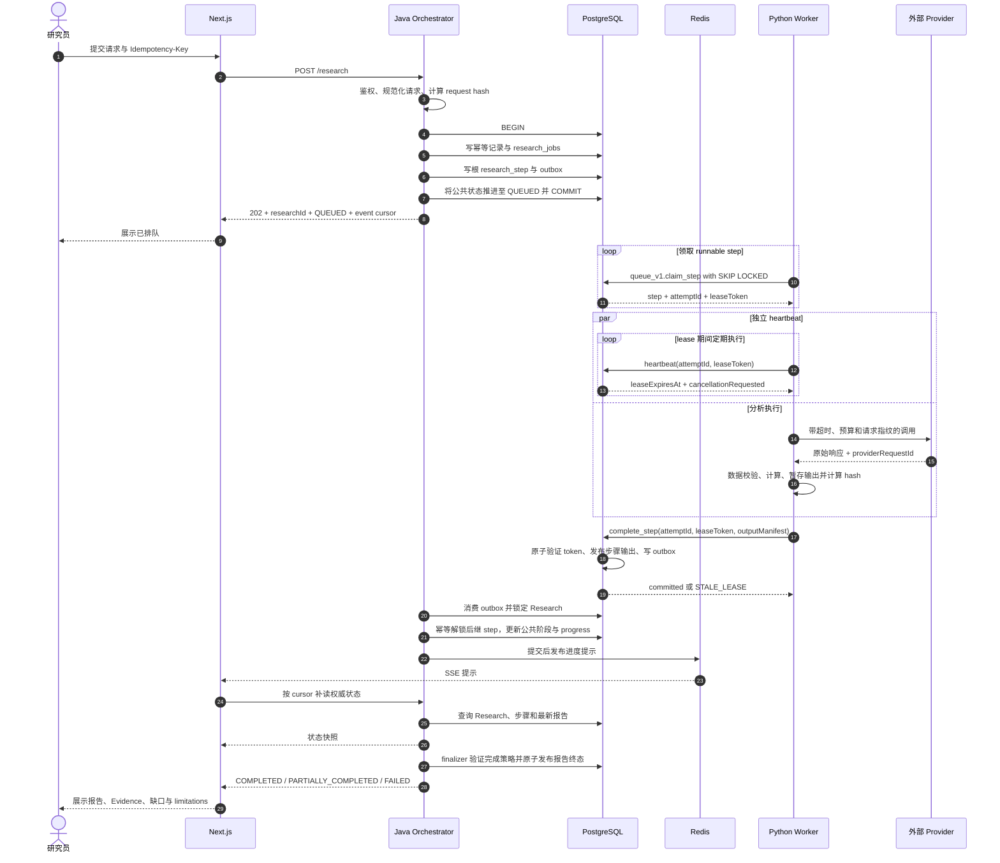
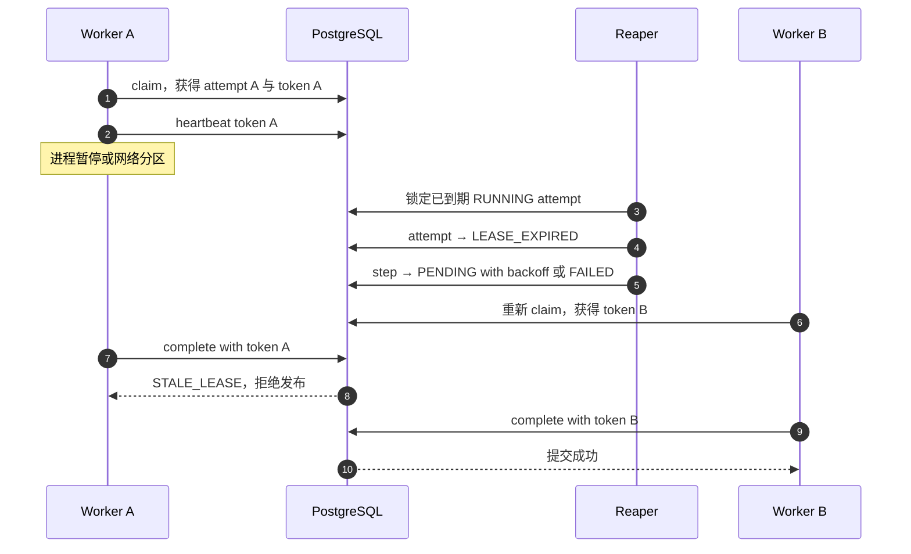
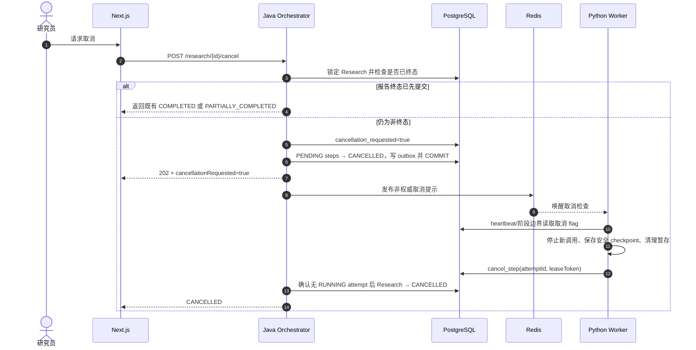

# 数据流与一致性边界

状态：Phase 0 基线

最后更新：2026-07-09

本文描述 Research 从提交到报告发布的数据路径，以及重复执行、lease 到期、取消和降级时的行为。组件职责见[架构基线](./architecture.md)，状态规则见[状态机](./state-machine.md)，队列 SQL 见 [ADR-0001](./adr/0001-postgres-job-queue.md)。

## 1. 不变量

1. PostgreSQL 是 Research、步骤、attempt、lease、取消、报告和 outbox 的唯一权威来源。
2. Redis 是可丢失的加速层；所有流程都必须有 PostgreSQL 回退路径。
3. API、DAG 推进、Worker 执行和事件投递都可能重复，提交边界必须幂等。
4. Worker 只能用当前 lease token 提交步骤结果，不能裁决 Research 终态。
5. LLM 只消费已登记 Evidence，不生成无来源数字；核心量化来自确定性 Python 输出。
6. 用户主动取消先提交时，最终只收敛为 `CANCELLED`；不能因已有内部 artifact 改判为 `PARTIALLY_COMPLETED`。

## 2. 业务流水线

内部 DAG 可并行执行，但公共 Research 状态按 canonical 阶段单调投影。

```mermaid
flowchart LR
    CREATE["CREATED / QUEUED"]
    RESOLVE["RESOLVING_SECURITY"]
    MARKET["FETCHING_MARKET_DATA"]
    OPTIONAL["基本面、监管文件、宏观<br/>可按配置并行"]
    QUALITY["VALIDATING_DATA"]
    QUANT["RUNNING_QUANT_ANALYSIS"]
    FUND["ANALYZING_FUNDAMENTALS"]
    EVIDENCE["BUILDING_EVIDENCE"]
    GENERATE["GENERATING_REPORT"]
    VALIDATE["VALIDATING_REPORT"]
    TERMINAL["COMPLETED / PARTIALLY_COMPLETED<br/>FAILED / CANCELLED"]

    CREATE --> RESOLVE
    RESOLVE --> MARKET
    MARKET --> OPTIONAL
    MARKET --> QUALITY
    OPTIONAL --> QUALITY
    QUALITY --> QUANT
    QUALITY --> FUND
    QUANT --> EVIDENCE
    FUND --> EVIDENCE
    EVIDENCE --> GENERATE
    GENERATE --> VALIDATE
    VALIDATE --> TERMINAL
```



`research_steps.available_at` 控制内部可执行性：`NULL` 表示依赖未满足；非空且小于等于数据库当前时间表示可 claim；未来时间表示重试退避。

## 3. 正常执行时序



## 4. 事务边界

### 4.1 `T1`：创建 Research

同一事务必须写入：

- API 幂等记录与规范化请求哈希；
- `research_jobs` 的不可变 `request_json`；
- 已满足依赖的根 `research_steps`，状态 `PENDING` 且 `available_at=now()`；
- `RESEARCH_QUEUED` outbox 事件。

任一写入失败则全部回滚。只有事务提交后才返回 `202`，因此客户端拿到 Research ID 时必有可恢复的持久工作。

### 4.2 `T2`：claim

一次短事务完成：

1. `FOR UPDATE SKIP LOCKED` 选取到期 `PENDING` step；
2. 再次确认 Research 未终态且 `cancellation_requested=false`；
3. step → `RUNNING`、attempt count 加一；
4. 创建唯一 `RUNNING` attempt，生成随机 lease token 和到期时间；
5. 写 `STEP_STARTED` outbox。

随后立即提交；计算过程中不持有连接事务或行锁。

### 4.3 `T3`：步骤发布

`queue_v1.complete_step` 的前置条件：

```text
attempt.status = RUNNING
attempt.lease_token = 调用者 token
attempt.lease_expires_at > database_now
research.cancellation_requested = false
step.status = RUNNING
```

原子效果：校验或复用相同 output manifest、attempt/step → `SUCCEEDED`、保存 output hash、写 `STEP_SUCCEEDED` outbox。条件更新影响 0 行时返回 `STALE_LEASE` 或 `CANCELLATION_REQUESTED`；Worker 不得无条件覆盖。

### 4.4 `T4`：DAG 推进

Java 锁定 Research，读取已发布步骤输出，幂等解锁后继步骤：

- 保持 `UNIQUE(research_job_id, step_type)`；
- 设置规范化 `input_hash`、`implementation_version` 和 `available_at`；
- 根据 canonical 阶段顺序单调更新公共 `status` 和 `progress`；
- 同事务写 outbox。

重复处理同一事件只会重复判断，不会重复创建逻辑步骤或让进度回退。

### 4.5 `T5`：报告与终态

Java finalizer 锁定 Research，确认无可能改变裁决的活动步骤，验证 Claim/Evidence、数据质量和 completion policy。`report_versions`、运行级结果清单、终态、`completed_at` 与 `REPORT_PUBLISHED` outbox 必须同事务提交。

## 5. Source Snapshot 与证据链

采集结果不能只标记为“最新数据”。每个 `source_snapshot` 至少保存：

- Provider、source type、请求参数、URL 或外部 ID；
- `published_at`、`retrieved_at`、`effective_date`、market timezone；
- 原始内容 hash、规范化数据 hash、schema/parser version；
- 缺失率、异常、单位、币种、复权和数据模式 `REAL | MOCK | MIXED_TEST`；
- Provider request ID 和授权范围。

Python 结果引用输入 snapshot 与 calculation version。Evidence 引用 source snapshot 或 quant result。每条发布 Claim 只能引用同 Research 的 allowlist Evidence；报告中的关键数字可回溯到计算参数和输入 hash。

## 6. 幂等与重复路径

| 重复来源 | 去重边界 | 行为 |
| --- | --- | --- |
| 创建响应丢失后重试 | API 幂等记录 | 同 key 同 hash 返回原 Research；不同 hash 返回 409 |
| outbox 重放 | event ID + step 逻辑唯一键 | 重复判断，不重复解锁或创建步骤 |
| lease 到期导致重复执行 | attempt lease token | 只有当前 token 可发布 |
| 相同步骤重试 | `researchId + stepType + inputHash + implementationVersion` | 已成功且输入/实现未变时复用输出 |
| Provider 调用重试 | Provider 幂等键或 request fingerprint | 优先复用已记录响应；保存 provider request ID |
| SSE 重复、乱序或丢失 | event cursor + PostgreSQL 补读 | 前端以状态快照校正 |

`input_hash` 不得包含 trace ID、attempt ID 或当前时间等非语义随机值，必须包含上游输出 hash、数据快照、计算/Prompt 版本和所有影响结果的参数。

## 7. Lease 到期



到期只表示 Worker A 失去提交权，不代表其物理停止。token 是防止旧 Worker 覆盖新 attempt 的 fencing credential。

## 8. 取消数据流



取消 API 幂等。取消 flag 先提交后，`complete_step` 必须拒绝成功发布；Reaper 看到取消时直接把过期步骤置 `CANCELLED`，不能再次排队。已完成内部步骤可保留审计，但不会把主动取消改判为 `PARTIALLY_COMPLETED`。

## 9. 部分完成数据流

`PARTIALLY_COMPLETED` 与取消无关，只允许以下降级路径：

1. 核心行情和核心量化成功；
2. 某些标记为 degradable 的基本面、监管文件或宏观模块失败/缺失；或报告修复移除了不合格 Claim；
3. Java 仍能从合法 Evidence 生成通过验证的安全报告；
4. 报告明确记录缺失模块、data quality、移除的 Claim 类型和 limitations；
5. finalizer 的最小安全策略通过、完整策略不通过。

若核心行情不足、证券无法解析、没有安全报告或报告验证失败且无法修复，则为 `FAILED`。如果取消 flag 已先提交，则无论已有多少内部 artifact，均等待 Worker 收敛后进入 `CANCELLED`。

## 10. 缓存与进度读取

读取采用 cache-aside：Java 按用户/资源/版本查 Redis，未命中时读 PostgreSQL，并写短 TTL 缓存。业务事务写 outbox；提交后 relay 可用于失效缓存。

MVP 由 TanStack Query 每 2 秒轮询 Java status API，进入终态后停止；PostgreSQL 始终是权威状态。SSE 仅是完整 v1 的可选优化，不属于 Phase 1-3 Gate。若启用，SSE 不保存唯一进度：客户端重连携带最后 event cursor，Java 从 outbox/数据库补读，超出事件保留窗口则返回完整 Research 快照。Redis 或 SSE 停机时继续轮询，状态正确性不变。

## 11. 错误与重试

| 分类 | 示例 | 默认策略 |
| --- | --- | --- |
| `TRANSIENT` | timeout、429、短时 5xx、连接失败 | 指数退避加抖动，受 attempts 与总时限限制 |
| `DATA_QUALITY` | 缺列、单位冲突、覆盖不足 | 不盲重试；生成质量结果，由 finalizer 降级或失败 |
| `INVALID_INPUT` | symbol/period 无效 | 不重试，安全错误返回用户 |
| `AUTHORIZATION` | Provider 权限不足、越权 | 不重试，告警并脱敏 |
| `RESOURCE_LIMIT` | 内存或数据预算超限 | 可拆分/降级；原配置不循环重试 |
| `BUG_OR_CONFLICT` | schema 不兼容、相同幂等键不同 hash | 隔离并告警，不自动覆盖 |

重试时 step 回到 `PENDING`，`available_at=database_now+backoff+jitter`；每次执行都新增 attempt，禁止覆盖失败历史。

## 12. 必测故障场景

- 创建响应丢失后以同一和不同请求 hash 重试。
- 至少 20 个 Worker 并发 claim，验证每步骤最多一个 RUNNING attempt。
- Worker 在输出暂存后、原子发布前崩溃。
- 旧 Worker 在新 token 已签发后恢复并晚到提交。
- heartbeat 与 Reaper 在到期边界竞争。
- 取消分别早于 claim、晚于 claim、早于发布、晚于报告终态。
- 非关键模块失败仍生成安全报告并进入 `PARTIALLY_COMPLETED`。
- 取消后存在内部 artifact 仍只能进入 `CANCELLED`。
- Redis 停机、outbox 重放/乱序、SSE 断线均不改变权威结果。
