# 数据模型（Phase 6 实现基线）

本文定义 Java 主服务的 PostgreSQL 逻辑模型。它优化了原始清单中的 `research_projects`、`research_steps`、`evidence_items` 和 `research_reports`：任务、逻辑步骤、每次尝试、来源快照、结论、证据关联和不可变报告版本分别建模，从而支持断点重试、完整数据血缘和版本审计。

## 1. 设计原则

- PostgreSQL 为任务状态、来源元数据、Evidence Registry 和报告版本的事实来源；Redis 只用于缓存、限流和短期协调。
- 所有服务端时间使用 `timestamptz` 并以 UTC 写入；仅“财务期末日、行情交易日、数据截至日”等业务日期使用 `date`。
- 金额、财务指标和计算结果使用 `numeric(38, 12)` 或更合适的显式精度，禁止用二进制浮点保存需要复核的金融数字。
- 外部原文和 Provider 响应先规范化并计算 SHA-256，再注册为不可变 `source_snapshots`；大对象放对象存储，数据库只保存 URI、摘要和哈希。
- ReportVersion、Claim、Evidence、来源快照和审计事件为追加式记录。发布后不原地修改；修复产生新版本。
- 用户删除研究任务是软删除。审计、来源、Evidence 和报告根据保留策略保留，不做级联物理删除。
- 多租户访问的所有查询都必须带 `user_id`/所有权条件；不可通过“查不到后再鉴权”的方式泄露资源是否存在。
- 所有来自 Mock Provider 的记录都保存 `is_demo_data=true`。任务与报告的 `data_mode` 只允许 `REAL | MOCK | MIXED_TEST`；`MIXED_TEST` 仅限测试且不可普通发布。

## 2. 核心 ER 图

```mermaid
erDiagram
    USERS ||--o{ RESEARCH_JOBS : owns
    SECURITIES ||--o{ RESEARCH_JOBS : targets
    RESEARCH_JOBS ||--|{ RESEARCH_STEPS : plans
    RESEARCH_STEPS ||--o{ STEP_ATTEMPTS : attempts

    RESEARCH_JOBS ||--o{ RESEARCH_SOURCE_LINKS : uses
    STEP_ATTEMPTS ||--o{ RESEARCH_SOURCE_LINKS : discovers
    SOURCE_SNAPSHOTS ||--o{ RESEARCH_SOURCE_LINKS : linked_as
    SOURCE_SNAPSHOTS ||--o{ MARKET_PRICE_BARS : contains
    SOURCE_SNAPSHOTS ||--o{ FINANCIAL_METRICS : contains
    SOURCE_SNAPSHOTS ||--o{ FILINGS : captures
    FILINGS ||--o{ FILING_CHUNKS : splits_into
    MACRO_SERIES ||--o{ MACRO_OBSERVATIONS : has
    SOURCE_SNAPSHOTS ||--o{ MACRO_OBSERVATIONS : contains

    RESEARCH_JOBS ||--o{ QUANT_RESULTS : computes
    RESEARCH_JOBS ||--o{ EVIDENCE_ITEMS : registers
    SOURCE_SNAPSHOTS ||--o{ EVIDENCE_ITEMS : supports
    QUANT_RESULTS ||--o{ EVIDENCE_ITEMS : derives

    RESEARCH_JOBS ||--o{ REPORT_VERSIONS : publishes
    REPORT_VERSIONS ||--|{ CLAIMS : states
    CLAIMS ||--o{ CLAIM_EVIDENCE_LINKS : cites
    EVIDENCE_ITEMS ||--o{ CLAIM_EVIDENCE_LINKS : supports
    REPORT_VERSIONS ||--o{ REPORT_EXPORTS : renders

    RESEARCH_JOBS ||--o{ LLM_CALLS : incurs
    RESEARCH_JOBS ||--o{ LLM_BUDGET_RESERVATIONS : reserves
    STEP_ATTEMPTS ||--o{ LLM_BUDGET_RESERVATIONS : owns
    USERS ||--o{ IDEMPOTENCY_RECORDS : submits
    RESEARCH_JOBS ||--o{ AUDIT_EVENTS : records

    USERS {
        uuid id PK
        citext email UK
        text password_hash
        varchar role
        varchar status
        timestamptz created_at
        timestamptz updated_at
        bigint row_version
    }

    SECURITIES {
        uuid id PK
        varchar symbol
        varchar company_name
        varchar exchange
        varchar security_type
        char currency
        varchar cik
        boolean active
        boolean is_demo_data
        timestamptz created_at
        timestamptz updated_at
        bigint row_version
    }

    RESEARCH_JOBS {
        uuid id PK
        uuid user_id FK
        uuid security_id FK
        varchar symbol_input
        text query
        varchar locale
        jsonb request_json
        varchar status
        smallint progress
        varchar current_step
        varchar data_mode
        boolean cancellation_requested
        timestamptz started_at
        timestamptz completed_at
        timestamptz deleted_at
        uuid deleted_by FK
        timestamptz created_at
        timestamptz updated_at
        bigint row_version
    }

    RESEARCH_STEPS {
        uuid id PK
        uuid research_job_id FK
        varchar step_type
        smallint sequence_no
        varchar status
        varchar input_hash
        varchar successful_output_hash
        timestamptz created_at
        timestamptz updated_at
        bigint row_version
    }

    STEP_ATTEMPTS {
        uuid id PK
        uuid research_step_id FK
        int attempt_number
        varchar status
        boolean retryable
        varchar input_hash
        varchar output_hash
        varchar worker_id
        timestamptz lease_expires_at
        timestamptz started_at
        timestamptz completed_at
        bigint duration_ms
        varchar error_code
        text error_message_safe
        timestamptz created_at
    }

    SOURCE_SNAPSHOTS {
        uuid id PK
        varchar provider
        varchar source_type
        text source_url
        timestamptz published_at
        timestamptz retrieved_at
        date effective_date
        char raw_data_hash UK
        text storage_uri
        boolean is_primary_source
        varchar freshness_status
        boolean is_demo_data
        varchar schema_version
        timestamptz created_at
    }

    RESEARCH_SOURCE_LINKS {
        uuid id PK
        uuid research_job_id FK
        uuid source_snapshot_id FK
        uuid step_attempt_id FK
        varchar purpose
        timestamptz created_at
    }

    MARKET_PRICE_BARS {
        bigint id PK
        uuid security_id FK
        uuid source_snapshot_id FK
        varchar interval
        timestamptz bar_time
        numeric open
        numeric high
        numeric low
        numeric close
        numeric adjusted_close
        numeric volume
        varchar provider
        timestamptz retrieved_at
    }

    FINANCIAL_METRICS {
        bigint id PK
        uuid security_id FK
        uuid source_snapshot_id FK
        int fiscal_year
        varchar fiscal_period
        date period_end_date
        varchar metric_name
        numeric metric_value
        varchar unit
        varchar provider
        timestamptz published_at
        timestamptz retrieved_at
    }

    FILINGS {
        uuid id PK
        uuid security_id FK
        uuid source_snapshot_id FK
        varchar filing_type
        varchar accession_number UK
        date filing_date
        date period_end_date
        text source_url
        char content_hash
        text raw_text_uri
        timestamptz retrieved_at
    }

    FILING_CHUNKS {
        uuid id PK
        uuid filing_id FK
        varchar section_name
        int chunk_index
        text chunk_text
        text search_vector
        char content_hash
        timestamptz created_at
    }

    MACRO_SERIES {
        uuid id PK
        varchar provider
        varchar external_series_id
        varchar series_name
        varchar unit
        varchar frequency
        timestamptz created_at
        timestamptz updated_at
    }

    MACRO_OBSERVATIONS {
        bigint id PK
        uuid macro_series_id FK
        uuid source_snapshot_id FK
        date observation_date
        date vintage_date
        numeric value
        timestamptz retrieved_at
    }

    QUANT_RESULTS {
        uuid id PK
        uuid research_job_id FK
        varchar metric_name
        numeric metric_value
        varchar unit
        varchar calculation_version
        char input_hash
        date input_data_start
        date input_data_end
        int sample_size
        jsonb warnings_json
        boolean is_demo_data
        timestamptz created_at
    }

    EVIDENCE_ITEMS {
        uuid id PK
        varchar public_id UK
        uuid research_job_id FK
        uuid source_snapshot_id FK
        uuid quant_result_id FK
        varchar evidence_type
        varchar title
        text summary
        jsonb value_json
        varchar unit
        numeric quality_score
        boolean is_demo_data
        timestamptz created_at
    }

    REPORT_VERSIONS {
        uuid id PK
        uuid research_job_id FK
        int version
        varchar report_schema_version
        jsonb report_json
        text report_markdown
        varchar validation_status
        char content_hash
        varchar data_mode
        date data_as_of_date
        uuid generation_llm_call_id FK
        timestamptz generated_at
        timestamptz created_at
    }

    CLAIMS {
        uuid id PK
        varchar public_id UK
        uuid report_version_id FK
        varchar claim_key
        varchar claim_type
        text statement
        numeric confidence
        varchar materiality
        varchar validation_status
        jsonb validation_notes
        timestamptz created_at
    }

    CLAIM_EVIDENCE_LINKS {
        uuid claim_id PK,FK
        uuid evidence_id PK,FK
        varchar support_role
        numeric relevance_score
        text citation_locator
        timestamptz created_at
    }

    REPORT_EXPORTS {
        uuid id PK
        uuid report_version_id FK
        varchar format
        varchar status
        text storage_uri
        char content_hash
        bigint size_bytes
        varchar error_code
        timestamptz expires_at
        timestamptz created_at
    }

    LLM_CALLS {
        uuid id PK
        uuid research_job_id FK
        uuid step_attempt_id FK
        varchar model_name
        varchar prompt_version
        varchar schema_version
        varchar request_hash
        varchar response_hash
        int input_tokens
        int output_tokens
        int cached_tokens
        numeric estimated_cost_usd
        bigint latency_ms
        varchar status
        varchar error_code
        varchar provider_request_id
        varchar pricing_version
        int network_call_count
        boolean is_mock
        timestamptz created_at
    }

    LLM_BUDGET_RESERVATIONS {
        uuid id PK
        uuid research_job_id FK
        uuid step_attempt_id FK
        varchar request_hash
        numeric reserved_cost_usd
        int reserved_call_count
        numeric actual_cost_usd
        int actual_call_count
        varchar status
        timestamptz expires_at
        timestamptz settled_at
    }

    IDEMPOTENCY_RECORDS {
        uuid id PK
        uuid user_id FK
        varchar http_method
        varchar request_path
        varchar idempotency_key
        char request_hash
        smallint response_status
        jsonb response_body
        uuid resource_id
        timestamptz expires_at
        timestamptz created_at
    }

    AUDIT_EVENTS {
        bigint id PK
        uuid research_job_id FK
        uuid actor_user_id FK
        varchar action
        varchar request_id
        jsonb metadata_json
        timestamptz occurred_at
    }
```



## 3. 表和边界说明

### 3.1 身份与证券

#### `users`

- `email` 使用 `citext`；约束 `UNIQUE (email)`。
- `role`: `USER | ANALYST | ADMIN`；`status`: `ACTIVE | LOCKED | DISABLED`。
- 演示用户仍使用普通用户结构，不得通过特殊主键绕过租户隔离。
- 密码只保存强密码哈希；若改用外部 IdP，则增加 `auth_provider` 和 `subject` 的唯一组合，不把 token 存入此表。

#### `securities`

- MVP `security_type` 只允许 `COMMON_STOCK | ETF`。
- 唯一约束 `UNIQUE (upper(symbol), exchange)`；`cik` 非空时使用部分唯一索引。
- `is_demo_data=true` 的证券资料只能来自 Mock Provider。搜索 API 将结果映射为 `dataMode=MOCK`，页面仍显示 `DEMO DATA - NOT REAL MARKET DATA`。

### 3.2 研究任务与可恢复执行

#### `research_jobs`

- `request_json` 保存创建时已经验证的完整请求快照；常用检索字段（`security_id`、`symbol_input`、`locale`、`status`）单独列出，避免频繁扫描 JSON。
- `locale` 只允许 `zh-CN | en-US`。请求省略时根据 `query` 的语言确定，解析后的最终值必须持久化，保证重试和历史版本语言稳定。
- 证券解析前允许 `security_id IS NULL`，但 `RESOLVING_SECURITY` 成功后必须非空。
- `progress` 检查约束为 `0 <= progress AND progress <= 100`。
- `data_mode`: `REAL | MOCK | MIXED_TEST`。它在任务创建时根据运行配置/测试上下文固定，不由客户端提交；`REAL` 任务不得在 Provider 故障时静默切换到 Mock，`MIXED_TEST` 仅允许测试上下文创建。
- `cancellation_requested` 与终态分离，使 Java Durable Executor 能协作式停止。
- `deleted_at/deleted_by/delete_reason` 实现软删除。常规索引均使用 `WHERE deleted_at IS NULL`。
- `row_version` 用于 JPA 乐观锁，防止 Executor、取消请求和重试同时覆盖状态。
- `latest_report_version_id` 通过组合外键 `(latest_report_version_id, id)` 绑定同一
  Research 的 `report_versions(id, research_job_id)`。`COMPLETED` 与
  `PARTIALLY_COMPLETED` 必须引用验证通过、非 `MIXED_TEST` 的报告版本。

#### `research_steps`

逻辑步骤一任务一行，保存最新状态和成功输出哈希。约束：

- `UNIQUE (research_job_id, step_type)`；
- `UNIQUE (research_job_id, sequence_no)`；
- 成功步骤仅当新的 `input_hash` 与 `successful_output_hash` 对应输入未变化时才可跳过；
- `status`: `PENDING | RUNNING | SUCCEEDED | FAILED | SKIPPED | CANCELLED`。

#### `step_attempts`

每次执行一行，禁止覆盖失败历史：

- `UNIQUE (research_step_id, attempt_number)`；
- 部分唯一索引 `UNIQUE (research_step_id) WHERE status = 'RUNNING'`，避免同一步同时运行两次；
- `retryable` 由分类后的错误决定，不能只按 HTTP 状态盲目设置；
- `input_hash` 是幂等执行边界；成功后写入 `output_hash`；
- `worker_id + lease_expires_at` 支持崩溃接管；续租和完成必须比较 Executor 所持 lease；
- `error_message_safe` 只能存脱敏信息，完整 Provider 响应不得进入数据库错误字段。

状态更新与 attempt 创建应在同一事务内，并使用 outbox/可靠队列发布后续工作；不得依赖“写库后尽力发消息”。若实现 outbox，增加 `outbox_events(id, aggregate_type, aggregate_id, event_type, payload_json, occurred_at, published_at)`，`id` 为消息去重键。

### 3.3 来源快照与规范化金融数据

#### `source_snapshots`

这是所有外部事实的来源根：

- `UNIQUE (provider, raw_data_hash, schema_version)` 去重相同规范化内容；
- 必填 `provider/source_type/retrieved_at/raw_data_hash/is_primary_source/freshness_status/is_demo_data/schema_version`；
- `published_at`、`effective_date` 允许缺失，但缺失原因需进入快照元数据；
- `raw_data_hash` 为规范化原文 SHA-256；不得用 URL 当内容身份，因为 URL 内容可能变化；
- `storage_uri` 指向不可变对象，URI 不能由外部输入直接拼接；
- Phase 3 Mock 闭环在没有对象存储时允许把受大小限制的规范化 fixture 保存于
  `payload_json`；真实 Provider 或大对象仍按不可变 `storage_uri` 扩展；
- `freshness_status`: `FRESH | STALE | VERY_STALE | UNKNOWN`，按照数据类型独立阈值计算；
- 来源内容不可执行，抓取文本在进入后续 LLM 前必须经过清洗和 Prompt Injection 边界隔离。

`research_source_links` 将可复用的全局快照关联到某次研究和发现它的 `step_attempt`。约束 `UNIQUE (research_job_id, source_snapshot_id, purpose)`，使缓存复用不丢失任务级血缘。

#### 规范化事实表

- `market_price_bars`: 每行关联 Research 与不可变 Source Snapshot，`UNIQUE (research_job_id, source_snapshot_id, symbol, interval, observation_date)`；检查 OHLC 一致、价格为正、`volume >= 0`。大规模后按 `observation_date` 月度/年度分区。
- `financial_metrics`: 每行关联 Research、Source Snapshot 和可选 Security，`UNIQUE (research_job_id, source_snapshot_id, metric_name, fiscal_period, period_end_date)`；保留 taxonomy、concept、accession、原始单位与 derived 标记，换算结果作为新指标或 QuantResult，不覆盖原值。
- `filings`: `UNIQUE (accession_number)`，并验证 SEC accession 格式；`raw_text_uri` 指向清洗前后可复核文本。
- `filing_source_snapshot_links`: `PRIMARY KEY (filing_id, source_snapshot_id)`；同一不可变 accession 可被多个刷新后的 Source Snapshot 复用，避免重复保存正文与全文索引，同时保持每次研究自己的来源血缘。
- `filing_chunks`: `UNIQUE (filing_id, section_name, chunk_index)`；`search_vector` 实际迁移使用 PostgreSQL `tsvector`，并建 GIN 索引。
- `macro_series`: 当前 v1 每行保存一条带 series 元数据的 observation，`UNIQUE (research_job_id, source_snapshot_id, series_id, observation_date)`，并保留 realtime start/end vintage 边界，避免使用后来修订值造成前视偏差。

三张规范化事实表均由触发器验证 Source Snapshot 已链接到同一 Research，并禁止 UPDATE/DELETE；重跑通过唯一键幂等。原始/规范化 JSON 快照仍是审计权威，事实表是可查询投影。

### 3.4 确定性计算

#### `quant_results`

- `UNIQUE (research_job_id, metric_name, calculation_version, input_hash)`；
- 必须保存 `input_data_start/input_data_end/sample_size/calculation_version/input_hash`，使结果可复算；
- `warnings_json` 记录缺失值、样本不足、除零或指标不可解释等问题；
- `metric_value` 可以为空，但此时必须有结构化 warning；不得用 0 代替“不可计算”；
- `is_demo_data=true` 表示至少一个实质输入来自 Mock 来源；这种混合只允许处于 `MIXED_TEST` 的测试任务。

图表时间序列如体量较大，可另建 `quant_series_points(quant_result_id, observed_at, value, dimensions_json)`，并约束 `UNIQUE (quant_result_id, observed_at, dimensions_hash)`，不把上千点塞入报告 JSON。

### 3.5 Evidence Registry、Claim 和报告版本

#### `evidence_items`

Evidence 是任务级不可变注册项：

- `public_id` 对外使用，格式 `ev_<ULID>`，全局唯一且不可猜测顺序；内部关联使用 UUID `id`；
- `research_job_id` 必填；`source_snapshot_id` 与 `quant_result_id` 至少一个非空；若为计算证据，应指向 QuantResult，QuantResult 的输入再追溯来源；
- `evidence_type`: `MARKET_PRICE | FINANCIAL_METRIC | SEC_FILING | MACRO_OBSERVATION | QUANT_RESULT | COMPANY_PROFILE | NEWS_ARTICLE | OTHER`；
- Evidence 的来源名称、URL、发布时间、抓取时间、有效日期、主来源标志、新鲜度和哈希通过 `source_snapshot_id` 获取，API 返回时展开为稳定快照；
- `value_json` 保存带类型的标量或小型结构，`unit` 独立保存；
- `quality_score` 检查约束 `0 <= quality_score AND quality_score <= 1`，只表示来源/记录质量，不表示某条 Claim 获得支持的程度；
- `is_demo_data` 必须等于其来源链路 Mock 标志的聚合值，不允许调用者手工降级为 false。

#### `report_versions`

- `UNIQUE (research_job_id, version)`，版本从 1 单调递增；版本号在事务中以任务行锁分配；
- `report_schema_version` 首版固定 `research_report_v1`，与
  `packages/shared-schemas/llm/research-report.schema.json` 一致；
- `report_json` 是通过 JSON Schema 验证的结构化报告，`report_markdown` 是同版本的可读渲染；
- `content_hash` 为规范化 `report_json` 的 SHA-256，便于 ETag、导出缓存和篡改检查；
- `validation_status`: `PENDING | PASSED | PASSED_WITH_WARNINGS | FAILED`；只有后两种通过态可作为正常最新报告，其中 `FAILED` 不发布；
- `data_mode` 必须与 ResearchJob 一致：`REAL` 版本只能引用真实 Evidence，`MOCK` 版本只能引用 Mock Evidence；混合引用必须为 `MIXED_TEST`，并由发布守卫禁止进入普通用户发布、分享和导出流程；
- `data_as_of_date` 与 `generated_at` 分开，禁止用生成时间冒充数据截至时间；
- 发布后禁止 UPDATE/DELETE，可用数据库触发器或仓储层守卫强制执行。

#### `claims`

- 每个报告结论一行，`public_id` 格式 `cl_<ULID>`，并与共享 LLM Schema 的 `^cl_[A-Za-z0-9_-]{1,64}$` 约束一致；持久字段使用 canonical `statement`、`materiality`、`calculation_ids_json`、`numeric_references_json` 与 `limitations_json`，不另造 `text/material` 方言；
- `UNIQUE (report_version_id, claim_key)`，`claim_key` 是报告内稳定位置，例如 `bull_case.1`；
- `claim_type`: `FACT | CALCULATION | INFERENCE | OPINION`；
- `confidence` 范围 0–1，表示该 Claim 基于已关联 Evidence/Calculation 的支持程度；`materiality=MATERIAL` 表示重要结论；
- `validation_status`: `PENDING | PASSED | PASSED_WITH_WARNINGS | FAILED`；验证说明使用 JSON 数组保存机器代码和安全消息。

#### `claim_evidence_links`

Claim 与 Evidence 是显式多对多，不把 Evidence ID 只埋在报告 JSON：

- 主键 `(claim_id, evidence_id)` 防止重复引用；
- 必须校验 `claim.report_version.research_job_id = evidence.research_job_id`，禁止跨任务串证据；
- `support_role`: `PRIMARY | SUPPORTING | CONTRADICTING | CONTEXT`；报告可保留反证，避免只收集支持材料；
- `relevance_score` 范围 0–1，只表示该 Evidence 与 Claim 的关联度；Claim 的整体支持程度仅记录在 `claims.confidence`。`citation_locator` 保存页码、章节、表格、JSON Pointer 或计算字段位置；
- 所有 `materiality=MATERIAL` 的 Claim 至少一个 `PRIMARY` 或 `SUPPORTING` 链接；`FACT`/`CALCULATION` 不得只关联 `CONTEXT`。

验证器在发布事务前至少检查：

1. 报告 JSON 中的 Claim/Evidence ID 与关系表完全一致；
2. 引用 Evidence 存在且属于同一 Research；
3. 数字、单位、日期与 Evidence 值一致；
4. Claim 类型合理，推断未冒充事实；
5. 过期、缺失、冲突和 Mock 数据已进入报告警告；
6. `materiality=MATERIAL` Claim 有支持证据。

首次验证失败可生成一次修复版本；再次失败时任务进入 `PARTIALLY_COMPLETED`，失败版本仍保留但不作为默认发布版本。

#### `report_exports`

- 一次渲染结果关联一个确切 ReportVersion，不关联“latest”指针；
- 建议唯一索引 `UNIQUE (report_version_id, format, content_hash) WHERE status = 'SUCCEEDED'`；
- `format`: `PDF | MARKDOWN | HTML`；`status`: `PENDING | RUNNING | SUCCEEDED | FAILED`；
- 对象存储文件名不可接受用户路径，下载使用短时签名 URL 或 API 流式响应；
- `MOCK` 导出必须显示 `DEMO DATA - NOT REAL MARKET DATA`；`MIXED_TEST` 禁止走普通导出流程；`size_bytes` 受配置上限约束。
- Phase 3 可把受大小限制的导出字节保存于 `content_bytes`，或写入安全
  `storage_uri`；成功记录必须有内容哈希和大小。状态转换允许更新，已发布
  ReportVersion 本身仍不可变。

#### `research_run_manifests`

- 每个执行周期一条不可变 manifest，唯一键 `(research_job_id, execution_cycle)`；
- 保存完成策略版本、输入/输出摘要、数据模式与规范化内容哈希；
- `PUBLISHED` manifest 必须引用同一 Research 的 ReportVersion；
- ReportVersion、manifest、`latest_report_version_id`、Research 终态和 outbox
  必须由 Java 在同一事务提交；`MIXED_TEST` 不得进入 `PUBLISHED`。

### 3.6 LLM 成本、幂等和审计

#### `llm_calls`

- 每次模型生成尝试一行；工具循环中的真实 Responses HTTP 次数保存在
  `network_call_count`，缓存命中可记录 `status=CACHE_HIT` 且不伪造输出 token；
- 保存模型配置值、Prompt/Schema/价格版本、token、延迟、成本、provider request ID 和
  脱敏错误，不保存密钥、Prompt、Evidence Pack、原始响应或错误 body；
- `request_hash` 基于模型、Prompt 版本、结构化输入和工具版本计算；
- `UNIQUE (step_attempt_id, request_hash)` 防止 Executor 重送造成重复费用；确需再次调用时使用新的 attempt；
- 状态固定为 `SUCCEEDED | FAILED | CACHE_HIT | REFUSED | INCOMPLETE`；失败调用仍追加审计，
  `response_hash` 可空，但 `error_code` 必须存在；真实调用的 `network_call_count >= 1`；
- 所有成本用 `numeric(18, 8)` USD，研究总成本通过聚合或物化视图计算，不维护易漂移的手工累加值。

#### `llm_budget_reservations`

- 在发出网络请求前锁定 `research_jobs` 行并写入 `RESERVED`，同时预留成本与最多
  `maxToolRounds + 1` 次真实调用；任务总成本和调用次数都计算已完成审计加活跃预留；
- `UNIQUE (step_attempt_id, request_hash)` 使同一请求的预留幂等；过期预留在下一次事务中
  转为 `RELEASED`；成功提交时写实际成本/调用数并转为 `SETTLED`；
- 身份字段、预留值和创建时间不可修改，只允许 `RESERVED → SETTLED | RELEASED`，禁止删除；
- 实际调用数不得大于预留调用数；未知价格、超成本或超调用数都在网络前失败关闭。

#### `idempotency_records`

- 唯一约束 `UNIQUE (user_id, http_method, request_path, idempotency_key)`；
- `request_hash` 不同则返回 `409 IDEMPOTENCY_KEY_REUSED`；
- 保存首个业务响应状态、响应体和 `resource_id`，重复请求原样重放；
- 记录至少保留 24 小时，清理只删除 `expires_at < now()` 且不在处理中记录；
- 不存 Authorization、Cookie 或其他敏感请求头。

#### `audit_events`

追加记录 `RESEARCH_CREATED | RETRY_REQUESTED | CANCEL_REQUESTED | SOFT_DELETED | STATUS_CHANGED | REPORT_PUBLISHED | EXPORT_CREATED` 等事件。`metadata_json` 只含变化摘要和资源 ID，不含完整用户问题、凭据、模型提示词或抓取原文。建议同时保存 `actor_type`、`actor_user_id`、`request_id`、`source_ip_hash`。

## 4. 关键约束汇总

| 表 | 唯一/检查约束 |
| --- | --- |
| `users` | `UNIQUE(email)`；合法角色和状态 |
| `securities` | `UNIQUE(upper(symbol), exchange)`；非空 CIK 部分唯一 |
| `research_jobs` | `progress BETWEEN 0 AND 100`；终态时间一致；软删除字段成组出现 |
| `research_steps` | `UNIQUE(research_job_id, step_type)`；`UNIQUE(research_job_id, sequence_no)` |
| `step_attempts` | `UNIQUE(research_step_id, attempt_number)`；每步最多一个 RUNNING attempt |
| `source_snapshots` | `UNIQUE(provider, raw_data_hash, schema_version)`；SHA-256 格式检查 |
| `research_source_links` | `UNIQUE(research_job_id, source_snapshot_id, purpose)` |
| `market_price_bars` | Research、Source、symbol、interval、observation date 复合唯一；OHLCV 合法性 |
| `financial_metrics` | Research、Source、指标、财期、period end 复合唯一 |
| `filings` | `UNIQUE(accession_number)`；内容哈希格式检查 |
| `filing_source_snapshot_links` | `PRIMARY KEY(filing_id, source_snapshot_id)`；Filing 与 Snapshot 的 data mode 一致且链接不可变 |
| `filing_chunks` | `UNIQUE(filing_id, section_name, chunk_index)` |
| `macro_series` | Research、Source、series、observation date 复合唯一；realtime vintage 合法性 |
| `quant_results` | `UNIQUE(research_job_id, metric_name, calculation_version, input_hash)` |
| `evidence_items` | `UNIQUE(public_id)`；来源/计算至少一个；quality_score 0–1 |
| `report_versions` | `UNIQUE(research_job_id, version)`；发布后不可变 |
| `claims` | `UNIQUE(public_id)`；`UNIQUE(report_version_id, claim_key)`；confidence 0–1 |
| `claim_evidence_links` | `PRIMARY KEY(claim_id, evidence_id)`；同 Research 边界 |
| `report_exports` | 成功结果按版本、格式和内容哈希部分唯一 |
| `llm_calls` | `UNIQUE(step_attempt_id, request_hash)`；token/成本非负 |
| `llm_budget_reservations` | `UNIQUE(step_attempt_id, request_hash)`；原子状态转换；实际调用数不超过预留 |
| `idempotency_records` | 用户、方法、路径、key 复合唯一；同 key 请求哈希一致 |

无法用简单 CHECK 表达的跨表约束（同 Research 引用、`MATERIAL` Claim 至少一条证据、报告不可变）应通过服务事务和可测试的数据库约束触发器双重保证。

## 5. 索引策略

首版建议索引：

```sql
CREATE INDEX ix_research_jobs_user_created
    ON research_jobs (user_id, created_at DESC)
    WHERE deleted_at IS NULL;

CREATE INDEX ix_research_jobs_user_symbol_status
    ON research_jobs (user_id, symbol_input, status, created_at DESC)
    WHERE deleted_at IS NULL;

CREATE INDEX ix_research_steps_job_sequence
    ON research_steps (research_job_id, sequence_no);

CREATE INDEX ix_step_attempts_recoverable
    ON step_attempts (status, retryable, lease_expires_at)
    WHERE status IN ('RUNNING', 'FAILED');

CREATE INDEX ix_source_snapshots_lookup
    ON source_snapshots (provider, source_type, effective_date DESC, retrieved_at DESC);

CREATE INDEX ix_market_price_bars_series
    ON market_price_bars (symbol, observation_date DESC);

CREATE INDEX ix_financial_metrics_series
    ON financial_metrics (symbol, period_end_date DESC, metric_name);

CREATE INDEX ix_evidence_job_type
    ON evidence_items (research_job_id, evidence_type, created_at DESC);

CREATE INDEX ix_report_versions_job_latest
    ON report_versions (research_job_id, version DESC);

CREATE INDEX ix_claim_links_evidence
    ON claim_evidence_links (evidence_id, claim_id);
```

分页列表按 `(created_at DESC, id DESC)` 保持稳定。公开 API v1 使用页码分页，但仓储层应使用确定性次级排序；数据量增长后可兼容增加 cursor，而不改变现有字段。

## 6. 审计字段与删除策略

可变业务表统一包含：

- `created_at`, `updated_at`；
- `created_by`, `updated_by`（系统任务允许为空并在审计事件标明 `actor_type=SYSTEM`）；
- `row_version`（JPA `@Version`）；
- 需要用户删除语义的根实体增加 `deleted_at`, `deleted_by`, `delete_reason`。

追加式表（`step_attempts`、`source_snapshots`、`market_price_bars`、`financial_metrics`、`macro_series`、`evidence_items`、`claims`、`claim_evidence_links`、`report_versions`、`llm_calls`、`audit_events`）只允许插入和受控保留期清理，不使用 `updated_at` 制造“可变历史”。更正通过新记录、状态事件或新报告版本表达。

推荐外键删除行为：

- 用户到 Research：`ON DELETE RESTRICT`；
- Research 到步骤、Evidence、报告：`ON DELETE RESTRICT`，软删除根实体；
- SourceSnapshot 到规范化事实/Evidence：`ON DELETE RESTRICT`；
- Claim/ReportVersion/Evidence 关系：`ON DELETE RESTRICT`；
- 临时导出对象可到期清理数据库行，但不能影响 ReportVersion。

## 7. Mock/Test 血缘不变量

`is_demo_data` 和 `data_mode` 是数据完整性字段，不是前端装饰：

1. Mock Provider 写入的 `source_snapshots.is_demo_data` 必须为 true；真实 Adapter 必须为 false，二者由已固定的 Provider mode 决定。
2. 规范化事实继承其 SourceSnapshot；QuantResult 和 Evidence 按完整输入血缘传播 `is_demo_data`，不得通过复制值创建伪 REAL Evidence。
3. `REAL` ResearchJob 的所有实质来源必须为真实数据；Provider 失败时应失败或部分完成，不得自动回退 Mock。
4. `MOCK` ResearchJob 的实质来源必须全部为 Mock；API 返回 `dataMode=MOCK`，页面和全部导出显示 `DEMO DATA - NOT REAL MARKET DATA`。
5. `MIXED_TEST` 只能由测试/故障演练身份创建，可以混合来源；报告必须被发布守卫标为不可普通发布、不可分享、不可普通导出。
6. ReportVersion 继承并复核 ResearchJob 的固定模式；API、Web、导出和审计事件使用同一机器枚举，不用 `DEMO` 代替 `MOCK`。

建议使用数据库视图或发布事务中的校验 SQL 复核血缘，并为“Mock Evidence 被标成 REAL”和“`MIXED_TEST` 被普通发布”设置阻断性测试。

## 8. Flyway 迁移顺序

实际迁移按阶段拆分，避免一个巨大迁移难以回滚和审查：

1. `V1__identity_and_securities.sql`
2. `V2__durable_research_workflow.sql`（Research/Step/Attempt、幂等、审计与 outbox）
3. `V3__durable_queue_api.sql`（状态守卫与 `queue_v1` lease/fencing 函数）
4. `V4__research_job_projection_constraints.sql`（Phase 2 已实现）
5. `V5__phase3_research_artifacts.sql`（SourceSnapshot、QuantResult、Evidence、
   Claim、ReportVersion、Export、LLM Call、run manifest、Mock seed 与血缘守卫）
6. `V6__atomic_step_advancement.sql`（fenced 完成与后继步骤原子解锁）
7. `V7__phase5_evidence_and_filing_search.sql`（Source Snapshot 元数据、Claim 日期引用、
   Filing、不可变 Filing Chunk、生成式 `tsvector` 与 GIN 全文索引）
8. `V8__phase6_llm_budget_and_audit.sql`（LLM provider/pricing/request 元数据、真实网络
   调用计数、预算预留/结算 ledger、幂等和不可变状态守卫）
9. 后续迁移从 `V9` 起按 Phase 7+ 增量顺序追加，不得改写已发布迁移 checksum。

Phase 2 已实现的迁移、函数签名和实测范围见
[Phase 2 PostgreSQL 与 Durable Queue](./database-phase2.md)。

每个迁移必须由 Testcontainers PostgreSQL 集成测试验证：全新建库、从上一版本升级、唯一约束、软删除可见性、并发版本分配、同一步并发 attempt、Evidence 跨任务引用拒绝、报告不可变、Mock 血缘、Filing/Chunk 不可变、GIN 检索、旧报告 Snapshot 绑定、LLM 预算原子性/审计不可变和 `MIXED_TEST` 发布阻断。
