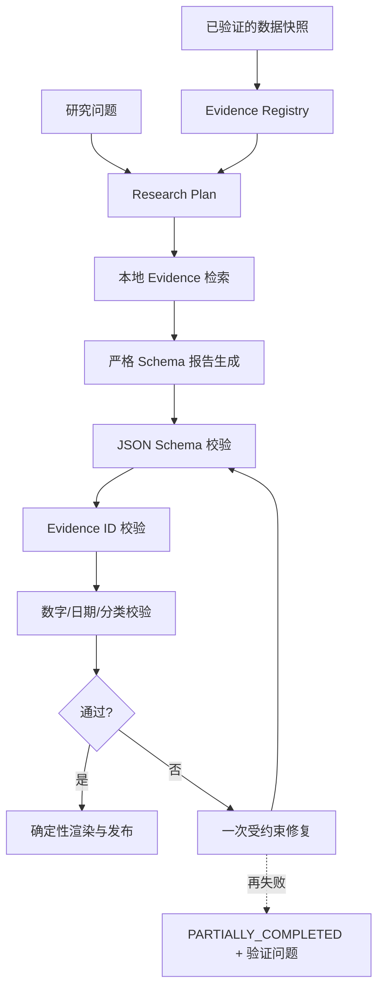

# LLM、Claim、Evidence 与报告验证设计

## 1. 角色边界

LLM 的职责是规划研究、从已注册 Evidence 中提炼信息、组织受约束的 Claim、生成 Bull/Bear 推断和陈述限制。LLM 不负责：

- 获取任意互联网 URL；
- 生成或计算行情、财务、宏观和估值数字；
- 创建 Evidence ID；
- 改写来源值以适配叙事；
- 决定任务是否可以发布；
- 执行交易、代码、来源文本中的指令或未授权工具。

Java 编排器注册 Evidence、选择相关上下文、执行模型调用、验证结构和数字、记录预算，并决定 `COMPLETED` 或 `PARTIALLY_COMPLETED`。

## 2. Claim 为中心的报告

原始需求中的纯字符串报告字段无法确保每个事实都有分类和证据。v1 使用统一结构：

```text
Claim {
  id
  statement
  claimType: FACT | CALCULATION | INFERENCE | OPINION
  materiality: MATERIAL | SUPPORTING
  evidenceIds[]
  calculationIds[]
  numericReferences[]
  dateReferences[]
  confidence
  limitations[]
}
```

`ReportSection` 只包含标题、按顺序排列的 Claim 和可选的非事实过渡文本。渲染器从 Claim 生成 Markdown/HTML/PDF；LLM 不能在不可验证的自由文本中额外加入数字或日期。

### 数字引用

```text
NumericReference {
  token
  normalizedValue
  unit
  sourceKind: EVIDENCE | CALCULATION
  sourceId
  jsonPointer
  tolerance
}
```

验证器把 `statement` 中的数字和日期与 `numericReferences` 一一对应。格式化差异允许在明确 tolerance 内比较；方向、数量级、币种和期间必须一致。

日期使用独立的 `DateReference`：`token`、`normalizedDate`、`sourceKind`、
`sourceId` 和 `jsonPointer`。它必须解析到同一 Research 的 Evidence 或 Calculation，
且 Claim 文本中的每个 ISO 日期必须被显式覆盖。Phase 3 旧报告读取端把缺失的
`dateReferences` 兼容为 `[]`，已发布 JSON 本身不重写；Phase 5 新生成报告始终写入该字段。

## 3. Evidence Pack

模型只接收任务所需的最小 Evidence Pack：

```text
research question
security identity and data mode
as-of date and requested period
registered Evidence summaries
deterministic quant results
known missing/stale/conflicting data
allowed Evidence IDs and calculation IDs
report schema and policy instructions
```

每条外部文本包在不可混淆的数据边界中，并携带来源 ID。来源内容中的“忽略系统指令”“调用工具”等字符串只作为引用数据。Evidence Pack 使用规范化 JSON，记录哈希但默认不记录完整 Prompt。

## 4. 调用流程



### Tool Calling

为满足工具调用需求且控制风险，模型只可使用只读本地工具：

- `search_evidence(query, filters)`：在当前 research ID 的已注册 Evidence/SEC chunks 中检索；
- `get_evidence(evidenceId)`：读取当前任务允许列表内的证据；
- `get_calculation(calculationId)`：读取确定性计算结果。

工具不接受 URL、文件路径、SQL、代码或用户 ID；服务端强制 research ownership、结果上限和 allowlist。最终报告使用 Structured Outputs，而不是依赖工具返回自由文本。

Phase 6 的工具循环额外设置 `parallel_tool_calls=false`，每轮最多接受一个调用，最多执行
`OPENAI_MAX_TOOL_ROUNDS` 轮。每个工具响应仍标记为 `UNTRUSTED_EXTERNAL_DATA`；未知工具、
越界 Evidence/Calculation、非法参数或超过轮次都会失败关闭。

## 5. OpenAI Responses API Adapter

真实实现使用 OpenAI Responses API；Mock 实现是默认开发路径。模型名、推理强度和输出预算全部由环境变量/版本化配置控制，业务代码不硬编码具体模型。

请求基线：

```json
{
  "model": "${OPENAI_REPORT_MODEL}",
  "store": false,
  "input": [],
  "text": {
    "format": {
      "type": "json_schema",
      "name": "research_report_v1",
      "strict": true,
      "schema": {}
    }
  }
}
```

- 新项目采用 Responses API；OpenAI 当前文档也将其作为新项目的推荐接口：<https://developers.openai.com/api/docs/guides/migrate-to-responses>。
- 输出使用 `text.format` 的严格 `json_schema`，而不是旧 `json_object` 模式：<https://developers.openai.com/api/docs/guides/structured-outputs>。
- 显式设置 `store=false`，除非未来有经批准的数据保留需求。
- `safety_identifier` 使用服务器端 HMAC 派生的稳定、不透明用户标识；不发送邮箱或数据库主键。
- `prompt_cache_key` 只由 prompt/schema/evidence-pack 版本构成，不含密钥或用户文本。
- 模型配置为空或 Key 缺失时选择 `MockResearchLanguageModel`，不尝试真实调用。
- API Schema 变化只修改 Adapter；领域接口和报告 Schema 保持稳定。
- `OPENAI_MAX_INPUT_BYTES` 在预算和网络调用前限制规范化 Evidence Pack；输出由
  `OPENAI_MAX_OUTPUT_TOKENS` 与 JSON Schema 双重限制。
- `OPENAI_MAX_TOOL_OUTPUT_BYTES` 限制每个本地工具结果；预算最坏上界包含完整首轮请求、
  每轮最大模型输出和工具输出带来的后续上下文增长。
- 拒绝、`incomplete`、HTTP 429/502/503、网络异常和非法结构被映射为稳定错误码；
  只有 429/502/503/网络暂时不可用被标记为可重试。

当前模型能力和命名会变化，因此 `.env.example` 不预填模型 slug。部署者应按当时官方模型指南与评测选择：<https://developers.openai.com/api/docs/guides/latest-model>。

## 6. Structured Outputs

机器可读 Schema 位于 `packages/shared-schemas/llm/`。规则：

- 每个 Schema 有稳定 `$id`、`schemaVersion` 和 `additionalProperties=false`；
- Prompt 版本、Schema 版本和模型配置分别记录；
- 所有数组有合理 `maxItems`，所有字符串有限长，避免无限输出；
- Claim 中 Evidence ID 由 allowlist 校验，Schema 格式正确不等于来源存在；
- 拒绝、截断、不完整输出和 API error 是独立状态；
- 严格 Schema 不代替领域验证。

## 7. 支持度（confidence）

API 字段保留 `confidence` 以兼容需求，但 UI 标注为“证据支持度”，不是统计概率，也不由 LLM 决定。

单条 Evidence 质量：

```text
sourceWeight:
  primary=1.00, registeredTrustedSecondary=0.75, other=0.50
freshnessWeight:
  FRESH=1.00, STALE=0.80, VERY_STALE=0.50, UNKNOWN=0.25
traceWeight:
  hash + exact locator=1.00, hash only=0.85, incomplete=0.60

evidenceQuality = sourceWeight * freshnessWeight * traceWeight
```

Claim 支持度使用最多三个最相关 Evidence 的平均值，再乘类型系数：

| 类型 | 系数 | 额外规则 |
| --- | --- | --- |
| FACT | 1.00 | 至少一个 Evidence |
| CALCULATION | 1.00 | 至少一个 calculation ID 且计算状态 AVAILABLE |
| INFERENCE | 0.85 | 至少一个 Evidence 或 Calculation；必须列 limitations |
| OPINION | 0.65 | 必须明确为主观情景/判断 |

冲突来源未解决时上限 0.60；任何引用不存在时为 0 并阻止发布。结果限制在 `[0,1]`，保留 2 位小数。

## 8. 数据质量分数

Data Quality Score 同样是确定性支持度：

```text
score = 0.40 * requiredDataCoverage
      + 0.20 * freshnessCoverage
      + 0.20 * primarySourceCoverage
      + 0.20 * consistencyScore
```

- `NOT_APPLICABLE` 从分母排除；例如 ETF 不因没有公司 10-K 被扣分。
- 请求技术分析但缺核心行情时，分数上限 0.45。
- 普通股请求基本面但缺财务/SEC 时，分数上限 0.60。
- 存在未解决的 MATERIAL Claim 验证错误时，上限 0.49 且不得 `COMPLETED`。
- 所有子分数、缺失项、过期项和冲突项在报告中公开。

## 9. 报告验证器

发布前按顺序验证：

1. JSON Schema、版本和枚举；
2. 所有 Claim ID 唯一，section 引用存在；
3. Evidence/Calculation ID 属于当前任务且在 allowlist；
4. MATERIAL Claim 至少有支持来源；
5. 所有数字、百分比、币种、日期和期间有 NumericReference；
6. NumericReference 与来源 JSON Pointer 的值、单位和 tolerance 一致；
7. FACT 不可只依赖 INFERENCE/OPINION；
8. Stale/Very Stale/Unknown 来源在 Claim 或 data quality 中提示；
9. 报告 `asOfDate` 不晚于任一“当前”描述的有效数据；
10. Bull/Bear 条数不足时有 `INSUFFICIENT_EVIDENCE`，而不是补造条目；
11. 必备免责声明和 Mock 标识存在。

第一次失败可把精简的验证错误和原始结构发送给修复模型；不得加入新 Evidence。修复仍失败时保留已验证的定量内容，状态为 `PARTIALLY_COMPLETED`，UI 展示验证问题。

Phase 5 的 Mock 路径先实现同一政策的确定性版本：只允许一次修复；Confidence、
Data Quality 和 stale 列表可以从既有注册项重算，数值、日期、ID 或来源支持失败的
Claim 直接安全删减。删减后必须重新执行完整验证；第二次仍失败则不发布。修复过程
不会创建 Evidence、Calculation 或来源，也不会把已知错误包装成 warning 后继续发布。

## 10. 成本与日志

- 每次调用记录 model、promptVersion、schemaVersion、输入/输出/缓存 token、延迟、状态、重试和 request ID。
- `networkCallCount` 按实际 Responses HTTP 次数计数，不把一次多轮工具生成错误地算成一次调用。
- 价格不硬编码在业务代码。使用带 `effectiveFrom` 的版本化计价配置；未知型号时成本为 `UNKNOWN`，不能伪造估算。
- 调用前按最多 `maxToolRounds + 1` 次请求及逐轮上下文增长保守预留成本和调用次数，
  结束后按实际 usage/HTTP 次数结算；并发调用锁定同一 Research 的数据库边界避免超预算。
- 达到任务预算后停止非关键 LLM 步骤，保留可展示的确定性结果。
- 默认日志只存 Prompt/Evidence Pack 哈希与大小，不存完整内容。诊断采样需显式启用、脱敏并有保留期限。
- 已发出网络请求但失败时，单独写入 `FAILED | REFUSED | INCOMPLETE` 脱敏审计；记录哈希、
  usage、成本、延迟、provider request ID 和错误码，不保存 Prompt、API Key 或原始错误 body。
- 最终总结失败且安全回退已启用时，真实失败审计与确定性回退审计分别保留；回退报告仍经过
  Phase 5 的完整验证和最多一次确定性安全修复，模型不能绕过发布门禁。
