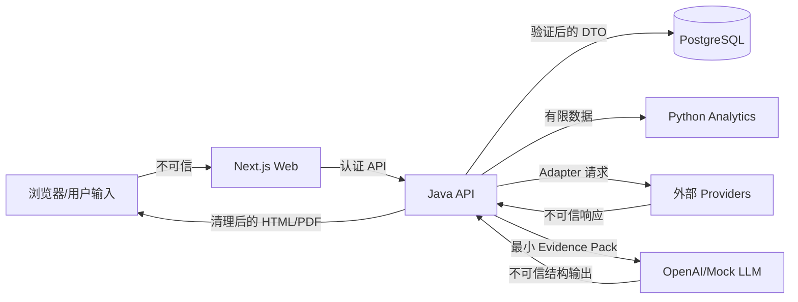

# 安全设计

## 1. 安全目标

1. 金融数据和结论可追踪、不可被 LLM 或外部文本暗中改写。
2. 用户只能访问自己的研究、Evidence、报告和导出。
3. Provider、LLM、数据库和导出边界不泄露密钥或敏感数据。
4. 外部 HTML/Filing/新闻始终是不可信数据，不能成为系统指令。
5. Mock 演示不能被误认为真实市场数据或生产安全配置。

## 2. 信任边界

即使通过 TLS 和 Schema，Provider/LLM 返回仍是不可信输入，必须经过领域验证。

## 3. 身份与授权

- Phase 3 继续使用 `dev-demo` Basic 固定演示用户，仅允许 development/test 且必须显式配置强度足够的演示密码；本地 Compose 只把应用端口发布到 host loopback。
- Bearer Token 是生产认证契约，但正式实现延后到后续阶段。production profile 无论是否误开 demo auth 都拒绝启动：不能用 Basic、空用户库或匿名模式假装生产鉴权已就绪。
- 从第一天开始，所有 research、report、evidence、export 查询都带 `owner_user_id` 条件；禁止“先按 ID 查再在 Controller 比较”的脆弱模式。
- 正式认证在后续阶段采用短期会话/Token、密码哈希（Argon2id 或受支持的强算法）、CSRF/同源策略和角色最小权限。
- `DELETE` 是软删除，只影响用户可见性；审计和来源链保留。
- Provider 状态页在 MVP 只读，绝不回显 API Key、末四位或可推断凭据的错误内容。

## 4. 输入、请求与资源限制

| 输入 | 基线限制 |
| --- | --- |
| symbol | 1-10 个规范化大写字符，支持 `.`/`-`，最终由 Security Master 验证 |
| research query | 10-4,000 UTF-8 字符 |
| title | 最多 200 字符 |
| 列表 page size | 默认 20，最大 100 |
| 导出 | 每份最大 25 MB，最多 200 页（可配置） |
| Provider 响应 | 按类型限制 body 大小；HTML/Filing 默认 20 MB |
| LLM 输入 | 规范化 Evidence Pack 默认最大 500,000 UTF-8 bytes，网络前拒绝超限 |
| LLM 工具输出 | 每次默认最大 32,768 UTF-8 bytes，超过时不进入下一轮模型请求 |
| LLM 输出 | Schema 数组/字符串上限 + API output token 上限 |

- Bean Validation/Pydantic/Zod 只负责边界格式；领域规则在服务层复验。
- 对 Unicode 做规范化用于比较，但保留原始用户文本用于审计；禁止控制字符进入日志/文件名。
- 文件名由服务器生成，用户输入不参与路径拼接。
- API 使用全局限流、单用户并发研究数和任务预算。

## 5. SSRF 与外部请求

- 普通研究请求不接受任意 URL。Provider Adapter 根据已注册 base URL 和结构化参数构造请求。
- SEC 来源 URL 由 accession number 映射生成；跟随重定向时每一跳重新验证 host/scheme。
- 只允许 HTTPS（本地 Mock/测试除外）；拒绝 userinfo、非标准端口、IP literal、私有/环回/链路本地/保留网段。
- DNS 解析前后都校验，防止 DNS rebinding；连接固定到已验证地址，并限制重定向次数。
- 设置连接、响应、总超时，body 上限和允许 Content-Type；压缩内容按解压后大小限制。
- Resilience4j Retry 仅覆盖 429、502、503、网络超时等临时错误；401、403、非法参数和 Schema 永久不兼容不重试。

## 6. Prompt Injection

最低控制链：

1. 系统指令与外部内容使用不同消息/明确数据边界；
2. 外部文本清理脚本、可执行片段和隐藏 HTML，但保留来源哈希；
3. 只发送与问题相关的最小 Evidence chunks；
4. Tool Calling 只允许当前 research 的 `search_evidence`、`get_evidence`、`get_calculation`；
5. 工具参数有 Schema、allowlist、ownership 和结果上限；
6. 模型不能添加 Evidence、URL、工具或系统指令；
7. 严格 Structured Outputs 后再做 Evidence、数字、日期和类型验证；
8. 来源文本中的命令永不执行；验证失败只允许一次不增加新 Evidence 的修复。

## 7. 密钥与配置

- 密钥只来自环境变量或部署 Secret Store；禁止提交 `.env`、真实 token、私钥或带凭据的示例。
- 启动时检查占位密码和生产必需项；生产不能使用 `change_me`、Mock Provider 或 demo auth。
- 日志过滤 Authorization、Cookie、API key 参数和常见 token 形态；异常对象不得序列化完整请求头。
- Provider 客户端不把密钥放入 cache key、metric label、trace baggage 或数据库。
- 密钥轮换不需改代码；每个 Provider 可独立禁用。

## 8. LLM 数据保护

- Responses 请求显式 `store=false`；未来改变前需要隐私和保留评审。
- `safety_identifier` 为 HMAC 派生的不透明值，不发送邮箱、用户名或数据库 ID。
- 默认不记录完整 Prompt、Evidence Pack 或模型原始响应；保存哈希、大小、版本、usage 和验证后的结构。
- Prompt cache key 只由 Prompt/Schema/Evidence Pack/工具版本构成；`safety_identifier` 使用
  HMAC 派生值，二者都不包含原始用户身份、问题或密钥。
- `parallel_tool_calls=false`，每轮最多一个只读工具；工具总轮次、输入 bytes、输出 token、
  单任务真实 HTTP 调用数和美元成本分别设置硬上限。
- 真实调用前在 PostgreSQL 原子预留最坏成本与调用数；未知价格或预算不足时不发网络请求。
- 已发出的失败调用只记录请求/响应哈希、usage、价格版本、延迟、provider request ID、
  稳定错误码和网络调用数；不保存错误 body 或 Authorization。
- Prompt 诊断采样默认关闭；启用时需要管理员开关、脱敏、访问控制和短保留期。
- 不向模型发送 Provider Key、密码、内部网络地址、无关用户数据或完整原始 Filing。

## 9. HTML、RAG 与导出

- 外部 HTML 使用 allowlist sanitizer，移除 script、style、iframe、object、事件属性、表单和危险 URL。
- SEC 文本 chunk 保存纯文本、section、字符区间、source snapshot ID；检索结果不能携带可执行标记。
- Markdown 渲染禁用原始 HTML或先清理；链接使用 `rel=noopener noreferrer`。
- PDF/HTML 模板不加载任意远程资源。图表、字体和 CSS 来自打包资产或经过验证的内联 SVG。
- 导出路由重新检查 ownership 和报告状态；文件采用随机 ID、短期下载、正确 Content-Type 与 `Content-Disposition`。
- PDF 失败不改变网页/Markdown 报告状态，只生成 `EXPORT_FAILED` 记录。

## 10. 数据库与审计

- 数据库账号分环境、最小权限；迁移账号与运行账号在生产分离。
- 密码哈希、token、API Key 不存普通业务表。
- 关键事件记录：研究创建/取消/重试/删除、Provider 配置变更、报告发布/导出、认证失败和授权拒绝。
- 审计日志保存 actor、action、resource、requestId、researchId、时间、结果和安全的变更摘要，不保存完整敏感 payload。
- 乐观锁/唯一约束保护幂等；数据库 lease 防止两个 worker 同时执行同一步骤。
- 备份加密并做恢复演练；删除策略区分用户可见软删除与法定/运营保留。

## 11. Web 与浏览器

- 生产强制 HTTPS、Secure/HttpOnly/SameSite Cookie、严格 CORS 和可信 Host。
- 设置 CSP，默认 `default-src 'self'`；图表/字体需显式 allowlist，不允许 `unsafe-eval`。
- 防点击劫持、MIME sniffing，设置 Referrer Policy 与 Permissions Policy。
- TanStack Query 缓存不持久化敏感研究到 localStorage；退出/切换用户清理缓存。
- 错误消息不暴露堆栈、SQL、Provider 原始 body 或内部 URL。

## 12. 供应链与容器

- 依赖锁定并由 Renovate/Dependabot 类工具提出可审查升级；CI 运行依赖和镜像扫描。
- 容器使用非 root 用户、最小镜像、只读根文件系统（可行处）和临时可写目录。
- Web、API、Analytics 不暴露数据库/Redis 到公网；Compose 仅为本地开发。
- GitHub Actions 使用最小 `permissions`，不在来自 fork 的不可信构建中暴露 Secret。
- 发布物记录源码 commit、依赖锁、Schema/Prompt/Calculation 版本。

## 13. 上线门禁

- [x] production profile 拒绝 demo auth；正式 Bearer/OIDC 未实现时整体启动失败关闭，不能用 Mock/default 冒充生产。
- [x] 所有 Research、Report、Evidence 和 Export 接口有 owner-scoped/跨用户隐藏测试。
- [x] SSRF official-host、超时、body/content-type 限制、恶意 HTML 和 PDF 远程资源禁用测试通过。
- [x] Prompt injection fixture 无法调用未授权工具或新增 Evidence。
- [x] 访问日志不记录 query/body/header；metric label 低基数且不含 key、用户或 Research ID；secret scan 必过。
- [x] 报告数字/日期/Evidence 验证失败时不会发布 COMPLETED。
- [x] Markdown/HTML/PDF 中的 Mock 标记和免责声明不可移除。
- [x] Node/Python 依赖扫描、最小权限容器策略和基础安全测试纳入 CI。
