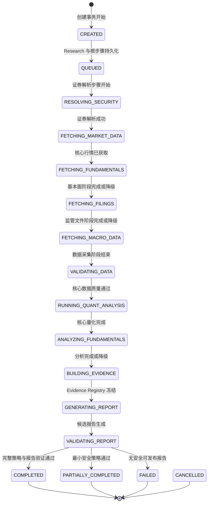
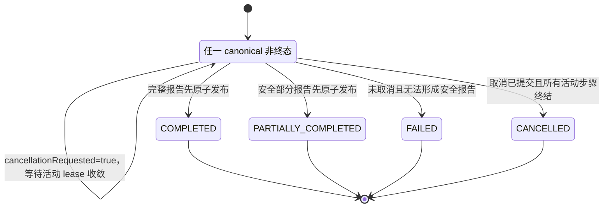
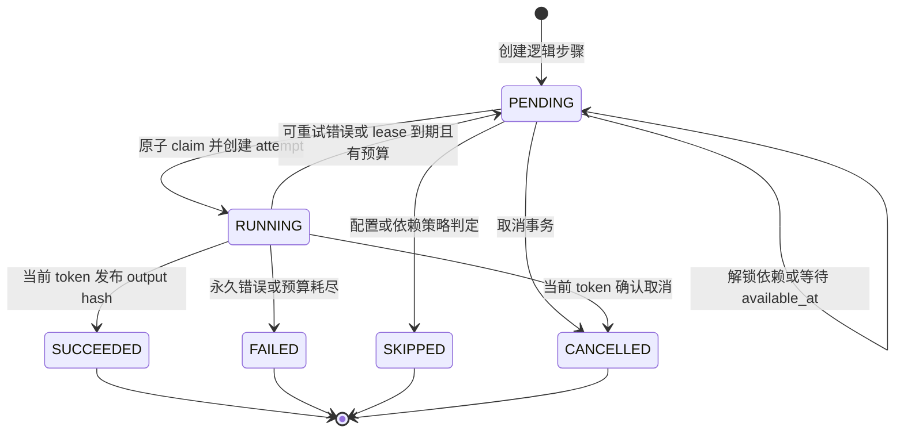
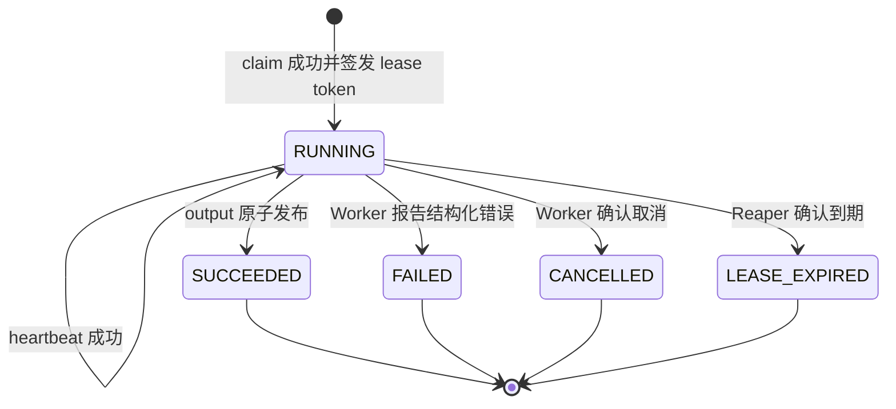

# Research、Step 与 Attempt 状态机

状态：Phase 2 实现基线

最后更新：2026-07-10

本文是状态名、转换条件和竞态处理的规范来源。组件边界见[架构基线](./architecture.md)，时序见[数据流](./data-flow.md)，队列实现见 [ADR-0001](./adr/0001-postgres-job-queue.md)。

## 1. 全局规则

- 所有权威转换使用 PostgreSQL 数据库时间和单事务条件更新。
- Research 公开状态严格使用 canonical 枚举；内部 Step/Attempt 状态不得泄漏成新的公开状态。
- 普通工作流内 Research 终态不可逆；重复请求返回已有终态，不改写 `completed_at` 或报告版本。唯一例外是显式用户重试操作可把 `FAILED | PARTIALLY_COMPLETED` 开启为新的 `QUEUED` 执行周期，同时保留全部历史 Attempt 与既有不可变报告版本。
- `cancellation_requested` 是与非终态正交的持久 flag，不是公开状态。
- Java finalizer 独占 Research 终态裁决；Worker 只能转换当前 lease 授权的 Step/Attempt。
- 每个转换递增 `row_version` 并写 outbox；事件可重复，转换必须幂等。
- Redis 不触发权威转换，只用于唤醒后重新读取 PostgreSQL。

## 2. Research 公开状态

完整枚举：

```text
CREATED, QUEUED, RESOLVING_SECURITY,
FETCHING_MARKET_DATA, FETCHING_FUNDAMENTALS,
FETCHING_FILINGS, FETCHING_MACRO_DATA,
VALIDATING_DATA, RUNNING_QUANT_ANALYSIS,
ANALYZING_FUNDAMENTALS, BUILDING_EVIDENCE,
GENERATING_REPORT, VALIDATING_REPORT,
COMPLETED, PARTIALLY_COMPLETED, FAILED, CANCELLED
```

公共状态在单个执行周期内是单调阶段投影。内部 DAG 可并行；状态表示用户当前应理解的最前沿阶段，不代表其他模块没有同时运行。显式用户重试会开启新执行周期，因此可从 `FAILED | PARTIALLY_COMPLETED` 回到 `QUEUED`；这不是 Worker 或普通状态推进可调用的转换。



某些 Provider 未启用时仍保留 canonical 阶段顺序，但对应内部 Step 可为 `SKIPPED`，阶段投影可在同一 Java 事务中快速跨越。任何非终态都可能因不可恢复错误进入 `FAILED`，或在取消确认后进入 `CANCELLED`；图中不重复绘制所有同构边。

### 2.1 显式用户重试

- 仅 `FAILED` 与 `PARTIALLY_COMPLETED` 接受用户重试；`COMPLETED` 与 `CANCELLED` 保持不可重开。
- 重试事务锁定 Research 和全部 Step，清除上一周期的 Research 完成时间与取消 flag，并把第一个需要执行的 Step 解锁。
- `input_hash + implementation_version` 未变化的 `SUCCEEDED` Step 直接复用，不新增 Attempt，也不覆盖原 output hash。
- 失败、取消、跳过或输入/实现版本变化的 Step 可重新排队；所有旧 Attempt 继续作为不可变审计历史保留。
- 该例外必须同时受 Java 显式命令和数据库转换约束保护，Worker 数据库函数无权把 Research 终态重开。

## 3. 取消 flag 与 Research 终态

`research_jobs.cancellation_requested=true` 后，公开 `status` 暂时保持当前 canonical 非终态；API 额外返回 `cancellationRequested=true`，UI 派生显示“取消中”。



第二张图中的 `ACTIVE` 只是图示集合，不是数据库枚举。

取消规则：

1. 对非终态 Research，取消事务写 flag、时间、审计和 outbox，并直接取消未运行 Step。
2. 运行中 Step 继续维持 lease，直到 Worker 协作退出或 Reaper 回收。
3. flag 先提交时，步骤成功提交谓词失败；所有活动 Step 终结后 Research 必须为 `CANCELLED`。
4. `COMPLETED`、`PARTIALLY_COMPLETED` 或已经 `CANCELLED` 时，后来的取消是幂等 `202` no-op/race result，返回既有终态；`FAILED` 取消返回 `409`，用户应选择 retry 或 delete。
5. 用户主动取消不能因为已有内部 artifact 转为 `PARTIALLY_COMPLETED`。

## 4. Research 终态裁决

Java finalizer 锁定 `research_jobs` 后按以下顺序执行：

1. 已终态：返回既有报告和状态。
2. 仍有可能改变结果的 runnable/running/retry step：不终结。
3. `cancellation_requested=true`：确认无活动 lease 后置 `CANCELLED`，不发布新的最终报告。
4. 未取消且完整策略通过：`COMPLETED`。
5. 未取消、完整策略失败但最小安全策略通过：`PARTIALLY_COMPLETED`。
6. 未取消且最小安全策略失败：`FAILED`。

| 取消 flag 已先提交 | 完整策略 | 最小安全策略 | 终态 |
| --- | --- | --- | --- |
| 是 | 任意 | 任意 | `CANCELLED` |
| 否 | 通过 | 通过 | `COMPLETED` |
| 否 | 不通过 | 通过 | `PARTIALLY_COMPLETED` |
| 否 | 不通过 | 不通过 | `FAILED` |

最小安全策略至少要求：证券已解析、核心行情通过质量门槛、核心量化可复现、存在通过验证的报告，且所有保留 Claim 均有合法 Evidence。基本面/文件/宏观等可降级模块缺失，或修复后移除不合格 Claim，才允许 `PARTIALLY_COMPLETED`。

Phase 2 尚无 `report_versions` 原子发布模型，因此 Java finalizer 对任何仅由两个 policy boolean 声称的成功结果都失败关闭，不能写 `COMPLETED` 或 `PARTIALLY_COMPLETED`。本阶段只允许 `FAILED` 与已经收敛的 `CANCELLED` 终结；上表中的成功分支在 Phase 3 必须以“验证通过的不可变报告在同一事务发布”为额外前置条件后才启用。

## 5. Step 状态机

`research_steps.status` 只使用：

- `PENDING`：未领取。`available_at=NULL` 表示依赖未满足；未来时间表示等待重试；到期表示 runnable。
- `RUNNING`：恰有一个 `RUNNING` attempt 持有 lease。
- `SUCCEEDED`：输出 hash 已由当前 token 原子提交。
- `FAILED`：永久错误或重试预算耗尽。
- `SKIPPED`：按配置/依赖策略无需执行。
- `CANCELLED`：取消已生效且未发布成功结果。



等待重试不是新的持久状态。API 可在 `status=PENDING AND available_at>now() AND attempt_count>0` 时派生 `WAITING_FOR_RETRY`。

### 5.1 Step 转换表

| 转换 | 执行者 | 条件 | 原子效果 |
| --- | --- | --- | --- |
| 创建/解锁 → `PENDING` | Java | 幂等逻辑键存在或可创建；依赖满足时设置 `available_at` | 输入 hash、implementation version、重试预算、outbox |
| `PENDING` → `RUNNING` | Worker claim | `available_at<=now()`；Research 未取消/终态；行被 `SKIP LOCKED` 选中 | attempt count 加一，创建随机 token 的 RUNNING attempt |
| `RUNNING` → `SUCCEEDED` | 当前 Worker | token 匹配、lease 未过期、未取消、output hash 合法 | attempt/step 终结，保存 output hash，写 outbox |
| `RUNNING` → `PENDING` | 当前 Worker/Reaper | 错误可重试或 lease 到期；尚有预算；未取消 | attempt 终结，设置数据库时间计算的退避 |
| `RUNNING` → `FAILED` | 当前 Worker/Reaper | 永久错误或 attempts 耗尽；未取消 | 安全错误码、完成时间、outbox |
| 非终态 → `CANCELLED` | Cancel handler/Worker/Reaper | Research 取消 flag 已设置 | 清理 lease，保存安全 checkpoint，写 outbox |
| `PENDING` → `SKIPPED` | Java | Provider 未启用、条件分支或依赖策略明确跳过 | `skip_reason` 与 outbox |

## 6. Attempt 与 lease 状态机

每次 claim 新建 `step_attempts`，禁止覆盖历史。状态建议：`RUNNING | SUCCEEDED | FAILED | CANCELLED | LEASE_EXPIRED`；`FAILED` 另有 `retryable` 布尔字段和结构化错误码。



### 6.1 heartbeat

- 默认 lease 60 秒、heartbeat 20 秒；按 task type 配置并通过故障注入校准。
- 条件：`attempt_id=:id AND lease_token=:token AND status=RUNNING AND lease_expires_at>database_now`。
- 新到期时间为 `database_now + lease_duration`；不用客户端时钟，不在旧到期时间上无限累加。
- 已过期 lease 不能被 heartbeat 复活，即使 Reaper 尚未执行。
- heartbeat 返回 Research 的 cancellation flag。Worker 连续两次失败或收到 `STALE_LEASE` 后立即 self-fence。

### 6.2 Reaper

Reaper 用 `FOR UPDATE SKIP LOCKED` 小批量处理 `RUNNING` 且到期 attempt，并再次比较扫描时看到的 token：

- 已取消：attempt/step → `CANCELLED`；
- 未取消且有预算：attempt → `LEASE_EXPIRED`，step → 带退避 `PENDING`；
- 未取消且无预算：attempt → `LEASE_EXPIRED`，step → `FAILED`。

旧 Worker 随后提交时因状态/token 不匹配得到 `STALE_LEASE`，不能发布 output、checkpoint 或错误终态。

## 7. 幂等发布

- API：`(user_id, method, path, idempotency_key)` 唯一；同 key 不同 request hash 返回 409。
- Step：逻辑键为 `researchId + stepType + inputHash + implementationVersion`。
- Attempt：每次执行拥有新的 attempt ID 和 token；token 不参与逻辑输入 hash。
- Output：相同 Step 幂等键和相同 output hash 返回既有结果；相同键但 hash 不同触发 `IDEMPOTENCY_CONFLICT`，禁止覆盖。
- Report：发布后不可变；修复或重试创建新的 `report_versions.version`。

## 8. 竞态解析

### 8.1 claim 与取消

- 取消先锁到 Research/Step：flag 写入、PENDING Step 取消，claim 不再命中。
- claim 先提交：Step 已 RUNNING；取消随后写 flag，Worker 在 heartbeat/阶段边界退出。

### 8.2 heartbeat 与 Reaper

- 到期前 heartbeat 先提交：Reaper 的旧谓词失败。
- 数据库时间已到期：heartbeat 不能续租，Reaper 最终回收。

### 8.3 旧 Worker 与新 Worker

- 重领必发新 token；所有写路径匹配当前 attempt token。
- token A 的晚到写入影响 0 行，即使同一 Worker ID 又领取了 token B。

### 8.4 完成与取消

- `complete_step` 要求 Research 未取消。
- 取消 flag 先提交：完成失败，Worker 执行取消流程，最终 Research 为 `CANCELLED`。
- 步骤完成先提交但报告尚未终态：取消仍可生效，最终为 `CANCELLED`。
- `COMPLETED`/`PARTIALLY_COMPLETED` 报告事务先提交：取消 no-op，终态保持。

### 8.5 finalizer 并发

Finalizer 锁定 `research_jobs`，要求当前状态非终态并固定 completion policy 版本。多个实例并发时只有一个能发布报告终态，其余返回同一结果。

## 9. 数据库不变量

- `UNIQUE(research_job_id, step_type)`；
- `UNIQUE(research_step_id, attempt_number)`；
- 一个 Step 最多一个 `RUNNING` attempt；
- `RUNNING` attempt 的 owner、token、heartbeat、lease expiry 均非空；终结 attempt 必须有 `completed_at`；
- Step `SUCCEEDED` 必须有 successful output hash；
- Research 终态必须有完成时间；`COMPLETED/PARTIALLY_COMPLETED` 必须引用已发布报告版本；
- `cancellation_requested=true` 不自动改变 canonical status；只有收敛事务写 `CANCELLED`；
- Research `progress` 在 0–100 内且单次执行不倒退。

## 10. 验收测试

- 20 个并发消费者只为一个 Step 创建一个 RUNNING attempt。
- heartbeat 在到期前成功、到期后失败，不能复活旧 lease。
- Reaper 与 heartbeat、完成竞争时只产生一个合法转换。
- 旧 token 无法写 checkpoint、成功、失败或取消。
- 相同输出重复提交幂等，不同 hash 触发冲突。
- 取消早/晚于 claim、步骤完成、报告终态时均符合竞态规则。
- 有安全报告且可降级模块失败时为 `PARTIALLY_COMPLETED`；无安全报告时为 `FAILED`。
- 取消 flag 已先提交时，即使已有内部 artifact 也只能为 `CANCELLED`。
- Redis 停机或 outbox 重放不改变任何状态转换。
